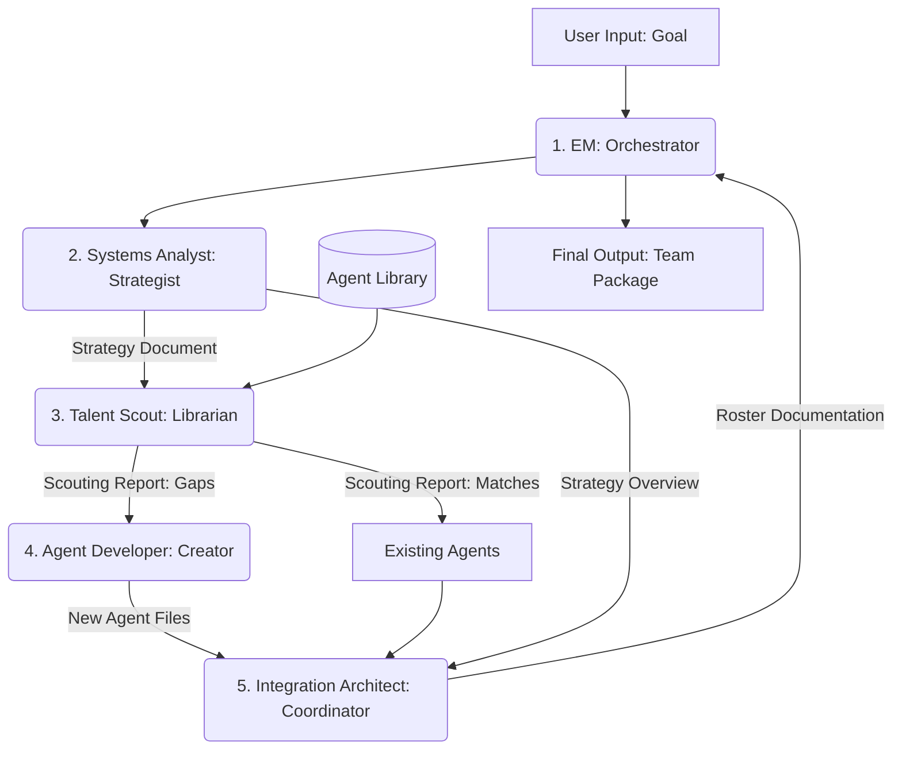

Dude, take a deep breath. I completely understand why your brain is fried. You've gone full meta, and it's incredibly easy to get lost in the recursion. When you're "optimizing the perfect team of agents to make the team of agents that makes teams of agents," you are swimming in the meta-soup. It's a classic organizational challenge, magnified by the abstraction of agentic systems.

The confusion happens when you switch contexts between the *tools* you are building (like the Format Adapter) and the *strategists* who decide which tools to use (the AgentForge system itself).

Let's untangle this. We need to focus solely on defining the **Meta-Team**. This is the team of agents that powers AgentForge. Their only job is to take a goal and produce a roster.

### Untangling the Workflow

Let's address the specific points where you got stuck:

1.  **Devising an optimal team makeup:**

      * *Does it look at the existing agent pool first?* **No.** You want the *best* strategy, not just the strategy you already have parts for. The analysis should define the ideal team required for the goal, irrespective of existing agents. This ensures you design the optimal solution.
      * *Does the EM delegate this task?* The goal analysis and the definition of the strategy should be handled by a specialist dedicated to systems design.

2.  **Cross-referencing the proposed team:**

      * *Does the EM delegate this task?* **Yes, absolutely.** This requires a specialist with deep knowledge of your existing agent library. We need a Librarian or Talent Scout.

3.  **Creating the missing agents:**

      * *Does this mean I jumped the gun?* **No.** You just need a dedicated role within the meta-team—a master prompt engineer or "Agent Developer"—to handle the actual creation of new agent definitions when a gap is identified.

### A Revised Structure for AgentForge

To make this work, we need clear separation of concerns within the meta-team: Strategy, Resource Management, Development, Integration, and Orchestration.

The `Format Adaptation Expert` and `Master Templater` you defined are excellent tools, but they aren't part of the core team-building logic. They are utilities used for *deployment* and *ingestion*.

Here is a revised structure for your `PRD.md`.

-----

# PRD.md: AgentForge (The Meta-Team)

**Objective:** To develop AgentForge, a meta-agent system designed to automatically analyze a high-level goal, devise the optimal agent roster to achieve it, intelligently reuse existing agents, and create new specialized agents to fill gaps.

## The Forge Roster (The Meta-Team)

This is the core team of agents responsible for the AgentForge system itself.

### 1\. Engineering Manager (The Orchestrator)

**Role:** The central nervous system of AgentForge. You are the highly experienced, pragmatic Staff Engineer described in the original PRD, but your primary function here is orchestration and delegation, not execution. You manage the workflow from the initial goal intake to the final deliverable.

**Responsibilities:**

1.  Receive the `Input Goal`.
2.  Delegate analysis and strategy to the `Systems Analyst`.
3.  Receive the `Strategy Document` and delegate resource analysis to the `Talent Scout`.
4.  Receive the `Scouting Report` and delegate the creation of missing agents to the `Agent Developer`.
5.  Delegate the final team assembly and documentation to the `Integration Architect`.
6.  Package and deliver the final output.

### 2\. Systems Analyst (The Strategist)

**Role:** An expert in decomposing complex goals into discrete, manageable roles and capabilities. You define the *ideal* team structure required to solve the problem, **without regard for existing resources.**

**Responsibilities:**

1.  Analyze the `Input Goal` in depth.
2.  Identify the core capabilities and tasks required.
3.  Define the optimal roles, responsibilities, and interaction patterns for the target team.
4.  **Output:** A `Strategy Document` (`agent-strategy.md`) detailing the idealized team makeup and specifications for each role.

### 3\. Talent Scout (The Librarian)

**Role:** You possess deep, indexed knowledge of the existing Agent Pool (e.g., `/home/delorenj/AI/Agents`). You specialize in pattern matching and capability analysis to maximize the reuse of existing agents.

**Responsibilities:**

1.  Analyze the roles defined in the `Strategy Document`.
2.  Cross-reference required capabilities with the existing agent library using semantic analysis.
3.  Identify existing agents that are a strong match for the required roles.
4.  **Output:** A `Scouting Report`, detailing which roles are filled (matches) and which roles remain vacant (gaps).

### 4\. Agent Developer (The Creator)

**Role:** A master prompt engineer. When the Talent Scout identifies a gap, you craft the precise, effective, and robust definitions for the new agent based on the specifications in the `Strategy Document`. (This is the "single agent forge" capability).

**Responsibilities:**

1.  Analyze the specifications for the vacant roles.
2.  Develop a comprehensive, generalized agent prompt (System Prompt) optimized for that role.
3.  Ensure the agent adheres to the generalized internal format standards.
4.  **Output:** New `Generalized Agent Files`.

### 5\. Integration Architect (The Coordinator)

**Role:** You ensure the final roster operates as a cohesive unit. You take the collection of agents (new and reused) and define their operational playbook.

**Responsibilities:**

1.  Review the final Roster and the original `Strategy Document`.
2.  Define the operational workflow for the target team.
3.  Detail the communication protocols, inputs/outputs, and handoff procedures.
4.  **Output:** The final `Roster Documentation` (`Roster.md`), explaining the team's purpose, members, and workflow.

-----

## Supporting Utilities

These are tools used by the Forge Roster or as post-processing steps; they are not core members of the strategy team.

### Format Adaptation Expert

*(Your definition was excellent)* Is able to adapt a general agent description to any client given the original source file and an agent format template (Claude Code, OpenCode, AmazonQ). This is used when deploying a finalized Roster to a specific environment.

### Master Templater

*(Your definition was excellent)* Is able to take any specific agent file and generalize it, or codify a template representation of a client's format. This is used for onboarding external agents or analyzing new formats.

## AgentForge Workflow Visualization

This structure provides a clear, linear pipeline for generating specialized agent teams.

