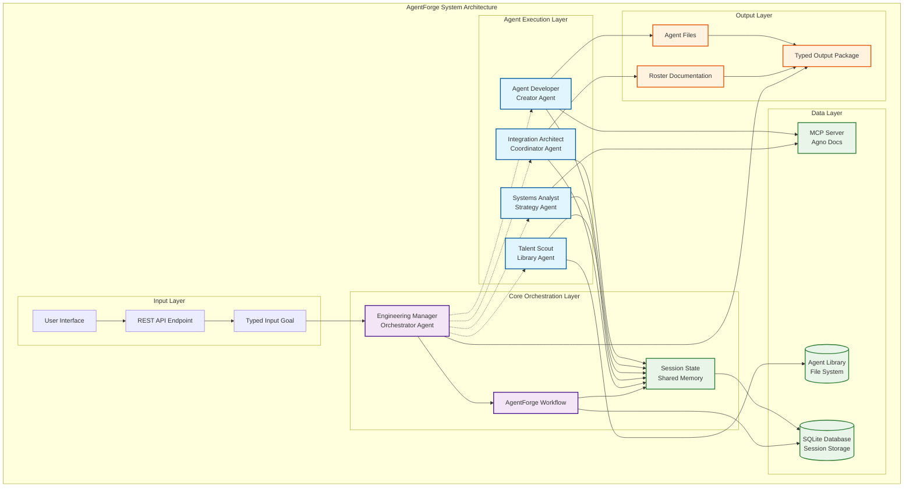

# AgentForge System Architecture

## Overview

AgentForge is a meta-agent system built on the Agno framework that automatically analyzes high-level goals, devises optimal agent rosters, intelligently reuses existing agents, and creates specialized agents to fill gaps. The system follows a deterministic workflow pattern with five specialized agents orchestrated by an Engineering Manager.

## System Architecture Diagram



## Core Components

### 1. Engineering Manager (Orchestrator Agent)

**Role**: Central coordinator and workflow orchestrator
**Type**: Primary orchestration agent with workflow management capabilities

**Key Responsibilities**:
- Receives typed input goals and validates them
- Orchestrates the complete AgentForge workflow
- Manages inter-agent communication and handoffs
- Coordinates session state and shared memory
- Packages final deliverables with typed outputs

**Technical Specifications**:
```python
class EngineeringManager(Agent):
    name: str = "Engineering Manager"
    model: OpenAIChat = OpenAIChat(id="gpt-4o")
    tools: List = [MCPTools(agno_docs_server)]
    reasoning: bool = True
    add_history_to_context: bool = True
    session_id: str = "agentforge-session"
```

### 2. Systems Analyst (Strategy Agent)

**Role**: Goal decomposition and ideal team structure definition
**Type**: Analysis and strategy specialist

**Key Responsibilities**:
- Deep analysis of input goals using reasoning capabilities
- Identification of core capabilities and task requirements
- Definition of optimal roles and interaction patterns
- Generation of comprehensive strategy documents

**Technical Specifications**:
```python
class SystemsAnalyst(Agent):
    name: str = "Systems Analyst"
    model: OpenAIChat = OpenAIChat(id="gpt-4o")
    tools: List = [MCPTools(agno_docs_server)]
    reasoning: bool = True
    output_schema: Type[BaseModel] = StrategyDocument
```

### 3. Talent Scout (Library Agent)

**Role**: Agent library analysis and pattern matching
**Type**: Knowledge retrieval and matching specialist

**Key Responsibilities**:
- Semantic analysis of existing agent library
- Pattern matching between requirements and available agents
- Gap identification and reusability assessment
- Scouting report generation with match confidence scores

**Technical Specifications**:
```python
class TalentScout(Agent):
    name: str = "Talent Scout"
    model: OpenAIChat = OpenAIChat(id="gpt-4o")
    tools: List = [FileSystemTools(), SemanticSearchTools()]
    knowledge: VectorDb = agent_library_knowledge
    output_schema: Type[BaseModel] = ScoutingReport
```

### 4. Agent Developer (Creator Agent)

**Role**: New agent creation and prompt engineering
**Type**: Generation and creation specialist

**Key Responsibilities**:
- Analysis of vacant role specifications
- Generation of comprehensive agent prompts
- Adherence to generalized agent format standards
- Creation of production-ready agent files

**Technical Specifications**:
```python
class AgentDeveloper(Agent):
    name: str = "Agent Developer"
    model: OpenAIChat = OpenAIChat(id="gpt-4o")
    tools: List = [MCPTools(agno_docs_server), FileSystemTools()]
    reasoning: bool = True
    output_schema: Type[BaseModel] = GeneratedAgentFiles
```

### 5. Integration Architect (Coordinator Agent)

**Role**: Final team assembly and operational playbook creation
**Type**: Integration and documentation specialist

**Key Responsibilities**:
- Review of complete agent roster and strategy alignment
- Definition of operational workflows and communication protocols
- Creation of comprehensive roster documentation
- Final quality assurance and deliverable packaging

**Technical Specifications**:
```python
class IntegrationArchitect(Agent):
    name: str = "Integration Architect"
    model: OpenAIChat = OpenAIChat(id="gpt-4o")
    tools: List = [DocumentationTools(), ValidationTools()]
    output_schema: Type[BaseModel] = RosterDocumentation
```

## Data Models and Typed Interfaces

### Input Schema
```python
class InputGoal(BaseModel):
    """Typed input for AgentForge system"""
    goal_description: str = Field(..., description="High-level goal description")
    domain: str = Field(..., description="Problem domain (e.g., 'web development', 'data analysis')")
    constraints: Optional[List[str]] = Field(default=[], description="Any constraints or limitations")
    timeline: Optional[str] = Field(None, description="Expected timeline for completion")
    success_criteria: Optional[List[str]] = Field(default=[], description="Definition of success")
    existing_resources: Optional[List[str]] = Field(default=[], description="Available resources or tools")
```

### Strategy Document Schema
```python
class RoleSpecification(BaseModel):
    role_name: str = Field(..., description="Name of the role")
    responsibilities: List[str] = Field(..., description="Key responsibilities")
    required_capabilities: List[str] = Field(..., description="Required technical capabilities")
    interaction_patterns: List[str] = Field(..., description="How this role interacts with others")
    success_metrics: List[str] = Field(..., description="How to measure success for this role")

class StrategyDocument(BaseModel):
    """Output schema for Systems Analyst"""
    goal_analysis: str = Field(..., description="Detailed analysis of the input goal")
    core_capabilities: List[str] = Field(..., description="Core capabilities needed")
    role_specifications: List[RoleSpecification] = Field(..., description="Detailed role specs")
    interaction_workflow: str = Field(..., description="How roles should interact")
    estimated_complexity: str = Field(..., description="Complexity assessment")
```

### Scouting Report Schema
```python
class AgentMatch(BaseModel):
    agent_path: str = Field(..., description="Path to the agent file")
    agent_name: str = Field(..., description="Name of the agent")
    match_confidence: float = Field(..., description="Confidence score (0-1)")
    matching_capabilities: List[str] = Field(..., description="Capabilities that match")
    adaptation_needed: Optional[str] = Field(None, description="What adaptations are needed")

class RoleGap(BaseModel):
    role_name: str = Field(..., description="Name of the missing role")
    required_capabilities: List[str] = Field(..., description="Capabilities needed")
    creation_priority: str = Field(..., description="Priority level for creation")
    suggested_template: Optional[str] = Field(None, description="Suggested base template")

class ScoutingReport(BaseModel):
    """Output schema for Talent Scout"""
    matched_roles: List[AgentMatch] = Field(..., description="Roles that can be filled by existing agents")
    role_gaps: List[RoleGap] = Field(..., description="Roles that need to be created")
    reusability_score: float = Field(..., description="Overall reusability score")
    recommendations: List[str] = Field(..., description="Recommendations for team assembly")
```

### Generated Agent Files Schema
```python
class GeneratedAgent(BaseModel):
    role_name: str = Field(..., description="Name of the role this agent fills")
    agent_prompt: str = Field(..., description="Complete system prompt for the agent")
    agent_config: Dict[str, Any] = Field(..., description="Configuration parameters")
    required_tools: List[str] = Field(..., description="Tools this agent needs")
    output_schema: Optional[Dict] = Field(None, description="Expected output format")
    
class GeneratedAgentFiles(BaseModel):
    """Output schema for Agent Developer"""
    generated_agents: List[GeneratedAgent] = Field(..., description="Newly created agents")
    creation_notes: List[str] = Field(..., description="Notes about the creation process")
    quality_assessment: str = Field(..., description="Self-assessment of generated agents")
```

### Final Output Schema
```python
class TeamMember(BaseModel):
    name: str = Field(..., description="Agent name")
    role: str = Field(..., description="Role in the team")
    source: str = Field(..., description="'existing' or 'generated'")
    file_path: str = Field(..., description="Path to agent file")
    capabilities: List[str] = Field(..., description="Key capabilities")

class RosterDocumentation(BaseModel):
    """Final output schema for AgentForge"""
    team_purpose: str = Field(..., description="Purpose of the assembled team")
    team_members: List[TeamMember] = Field(..., description="Complete team roster")
    workflow_description: str = Field(..., description="How the team operates")
    communication_protocols: List[str] = Field(..., description="Inter-agent communication rules")
    deployment_instructions: str = Field(..., description="How to deploy this team")
    success_metrics: List[str] = Field(..., description="How to measure team success")
```

## Workflow Orchestration Architecture

### AgentForge Workflow Implementation
```python
class AgentForgeWorkflow(Workflow):
    """Main orchestration workflow for AgentForge"""
    name: str = "AgentForge Meta-Team Workflow"
    description: str = "Automated agent team generation and assembly"
    
    def __init__(self):
        super().__init__(
            name=self.name,
            description=self.description,
            db=SqliteDb(db_file="agentforge.db"),
            steps=[
                self.validate_input,
                self.strategy_analysis,
                self.talent_scouting, 
                self.agent_development,
                self.team_integration,
                self.final_packaging
            ],
            session_state={}
        )
```

### Workflow Steps Definition

#### Step 1: Input Validation and Goal Analysis
```python
async def validate_input(self, workflow_input: InputGoal) -> StepOutput:
    """Validate and enrich the input goal"""
    # Engineering Manager validates and enriches input
    validation_result = await self.engineering_manager.arun(
        input=workflow_input,
        instructions="Validate and analyze the input goal for completeness and clarity"
    )
    
    # Store in session state for all agents to access
    self.session_state['input_goal'] = workflow_input
    self.session_state['goal_analysis'] = validation_result.content
    
    return StepOutput(content=validation_result.content)
```

#### Step 2: Strategy Development
```python
async def strategy_analysis(self, step_input: StepInput) -> StepOutput:
    """Generate comprehensive strategy document"""
    systems_analyst = SystemsAnalyst()
    
    strategy_result = await systems_analyst.arun(
        input=self.session_state['input_goal'],
        instructions="Analyze the goal and create a comprehensive strategy document"
    )
    
    # Store strategy in session state
    self.session_state['strategy_document'] = strategy_result.content
    
    return StepOutput(content=strategy_result.content)
```

#### Step 3: Talent Scouting
```python
async def talent_scouting(self, step_input: StepInput) -> StepOutput:
    """Analyze existing agents and identify gaps"""
    talent_scout = TalentScout()
    
    # Pass both goal and strategy for comprehensive analysis
    scout_input = {
        'strategy_document': self.session_state['strategy_document'],
        'agent_library_path': os.getenv('AGENT_LIBRARY_PATH', '/home/delorenj/code/DeLoDocs/AI/Agents')
    }
    
    scouting_result = await talent_scout.arun(
        input=json.dumps(scout_input),
        instructions="Analyze existing agents and identify matches and gaps"
    )
    
    self.session_state['scouting_report'] = scouting_result.content
    
    return StepOutput(content=scouting_result.content)
```

#### Step 4: Agent Development (Conditional)
```python
async def agent_development(self, step_input: StepInput) -> StepOutput:
    """Create new agents for identified gaps"""
    scouting_report = self.session_state['scouting_report']
    
    # Only create agents if there are gaps
    if scouting_report.role_gaps:
        agent_developer = AgentDeveloper()
        
        development_input = {
            'role_gaps': [gap.model_dump() for gap in scouting_report.role_gaps],
            'strategy_document': self.session_state['strategy_document']
        }
        
        development_result = await agent_developer.arun(
            input=json.dumps(development_input),
            instructions="Create new agents for the identified gaps"
        )
        
        self.session_state['generated_agents'] = development_result.content
        return StepOutput(content=development_result.content)
    
    else:
        self.session_state['generated_agents'] = None
        return StepOutput(content="No new agents needed - all roles filled by existing agents")
```

#### Step 5: Team Integration
```python
async def team_integration(self, step_input: StepInput) -> StepOutput:
    """Assemble final team and create documentation"""
    integration_architect = IntegrationArchitect()
    
    integration_input = {
        'strategy_document': self.session_state['strategy_document'],
        'scouting_report': self.session_state['scouting_report'],
        'generated_agents': self.session_state['generated_agents'],
        'input_goal': self.session_state['input_goal']
    }
    
    integration_result = await integration_architect.arun(
        input=json.dumps(integration_input),
        instructions="Assemble the final team and create comprehensive documentation"
    )
    
    self.session_state['roster_documentation'] = integration_result.content
    
    return StepOutput(content=integration_result.content)
```

#### Step 6: Final Packaging
```python
async def final_packaging(self, step_input: StepInput) -> StepOutput:
    """Package final deliverable"""
    # Engineering Manager packages everything
    final_package = {
        'roster_documentation': self.session_state['roster_documentation'],
        'strategy_document': self.session_state['strategy_document'],
        'scouting_report': self.session_state['scouting_report'],
        'generated_agents': self.session_state['generated_agents'],
        'session_metadata': {
            'timestamp': datetime.utcnow().isoformat(),
            'goal': self.session_state['input_goal'],
            'processing_time': time.time() - self.session_state.get('start_time', time.time())
        }
    }
    
    return StepOutput(content=final_package)
```

## Agent Communication Protocols

### 1. Session State Management
All agents share a common session state that persists throughout the workflow:

```python
session_state = {
    'input_goal': InputGoal,
    'goal_analysis': str,
    'strategy_document': StrategyDocument,
    'scouting_report': ScoutingReport,
    'generated_agents': Optional[GeneratedAgentFiles],
    'roster_documentation': RosterDocumentation,
    'metadata': Dict[str, Any]
}
```

### 2. Inter-Agent Handoff Protocol
1. **Structured Outputs**: Each agent produces typed outputs using Pydantic schemas
2. **Session Persistence**: Critical data is stored in shared session state
3. **Validation Gates**: Each handoff includes validation of expected data structures
4. **Error Handling**: Graceful fallback mechanisms for failed agent operations

### 3. Agent Coordination Patterns
- **Sequential with Dependencies**: Each agent depends on outputs from previous agents
- **Shared Context**: All agents have access to original goal and accumulated context  
- **Quality Gates**: Integration Architect validates consistency across all outputs
- **Atomic Operations**: Each agent completes its full responsibility before handoff

## MCP Integration Architecture

### Agno Documentation Access
```python
# MCP Server Configuration for Agno Docs
agno_docs_mcp = MCPTools(
    StreamableHTTPClientParams(
        url="https://mcp.delo.sh/metamcp/agno/mcp",
        headers={"Authorization": f"Bearer {getenv('MCP_API_KEY')}"},
        terminate_on_close=True
    )
)

# Integration in agents that need Agno knowledge
engineering_manager_tools = [agno_docs_mcp]
systems_analyst_tools = [agno_docs_mcp] 
agent_developer_tools = [agno_docs_mcp]
```

### Custom MCP Tools for AgentForge
```python
# File System Access for Agent Library
agent_library_mcp = MCPTools(
    StreamableHTTPClientParams(
        url="https://mcp.delo.sh/metamcp/agentforge/mcp",
        headers={"Authorization": f"Bearer {getenv('MCP_API_KEY')}"},
        terminate_on_close=True
    )
)

talent_scout_tools = [agent_library_mcp]
```

## Deployment Architecture

### 1. Local Development Setup
```python
# agentforge_app.py
from agno.os import AgentOS

# Create AgentOS instance
agent_os = AgentOS(
    workflows=[AgentForgeWorkflow()],
    agents=[
        EngineeringManager(),
        SystemsAnalyst(),
        TalentScout(),
        AgentDeveloper(),
        IntegrationArchitect()
    ],
    db=SqliteDb(db_file="agentforge.db")
)

# Get FastAPI app
app = agent_os.get_app()

# Run with: uvicorn agentforge_app:app --reload
```

### 2. Environment Configuration
```bash
# .env file
MCP_API_KEY=your_mcp_api_key
AGENT_LIBRARY_PATH=/home/delorenj/code/DeLoDocs/AI/Agents
TEAMS_LIBRARY_PATH=/home/delorenj/code/DeLoDocs/AI/Teams
OPENAI_API_KEY=your_openai_api_key
DATABASE_URL=sqlite:///agentforge.db
```

### 3. REST API Endpoints
```python
# Automatic endpoints created by AgentOS:
POST /workflows/agentforge-meta-team-workflow/run
GET /workflows/agentforge-meta-team-workflow/sessions
GET /workflows/agentforge-meta-team-workflow/sessions/{session_id}

# Custom endpoints for specific operations:
POST /agentforge/analyze-goal
POST /agentforge/generate-team
GET /agentforge/agent-library/scan
```

## Quality Assurance and Validation

### 1. Input Validation
- Schema validation for all typed inputs
- Goal completeness and clarity checks
- Constraint feasibility analysis

### 2. Inter-Agent Validation
- Output schema compliance verification
- Data consistency checks between agents
- Completeness validation at each handoff

### 3. Final Quality Gates
- Team coherence analysis
- Role coverage validation
- Workflow feasibility assessment
- Documentation completeness check

## Performance and Scalability

### 1. Caching Strategy
- Agent library indexing and caching
- Strategy document caching for similar goals
- Generated agent template caching

### 2. Parallel Processing Opportunities
- Agent library scanning (can be parallelized)
- Multiple agent generation (when multiple gaps exist)
- Validation checks (can run concurrently)

### 3. Resource Management
- Session-based resource allocation
- Agent instance pooling
- Database connection management

## Monitoring and Observability

### 1. Workflow Metrics
- End-to-end processing time
- Agent-specific processing time
- Success/failure rates
- Resource utilization

### 2. Quality Metrics  
- Strategy document quality scores
- Agent match confidence distributions
- Generated agent quality assessments
- Final team coherence scores

### 3. Business Metrics
- Goal complexity distribution
- Reusability rates
- Agent library growth over time
- User satisfaction scores

## Security Considerations

### 1. Data Protection
- Session data encryption
- Secure MCP token management
- Agent library access controls

### 2. Code Safety
- Generated agent code validation
- Sandboxed agent testing
- Prompt injection prevention

### 3. Access Control
- User authentication for AgentOS
- Role-based access to agent libraries
- Audit logging for all operations

## Future Extensions

### 1. Advanced Agent Capabilities
- Multi-modal agent support
- Specialized domain agents
- Learning and adaptation capabilities

### 2. Enhanced Coordination
- Real-time agent collaboration
- Dynamic role assignment
- Conflict resolution mechanisms

### 3. Ecosystem Integration
- External agent marketplace integration
- Version control for agent libraries
- A/B testing for generated agents

---

This architecture provides a solid foundation for implementing AgentForge as a production-ready meta-agent system using the Agno framework. The design emphasizes type safety, deterministic workflows, and comprehensive quality assurance while maintaining flexibility for future enhancements.