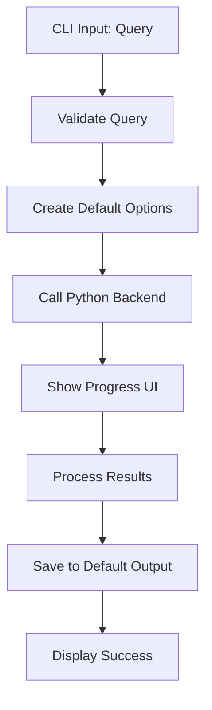
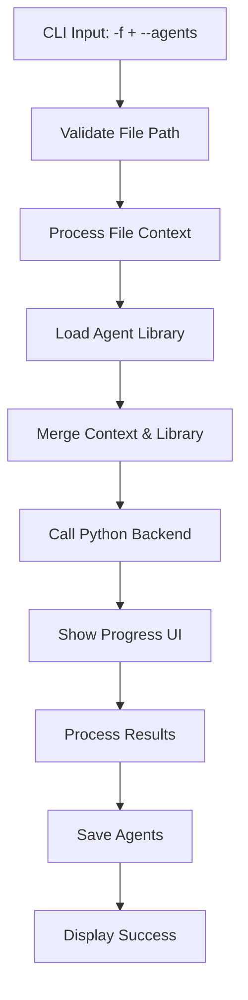
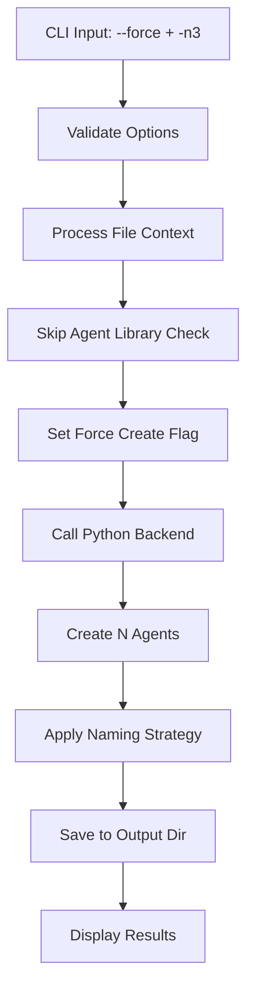

# AgentForge CLI Architecture Specification

## 🏗️ Architecture Overview

The AgentForge CLI is a **TypeScript/Node.js application** that serves as the primary interface for the AgentForge meta-agent system. It provides a user-friendly command-line interface that integrates seamlessly with the existing Python-based AgentForge orchestration system.

## 🎯 Core Design Principles

1. **Separation of Concerns**: CLI handles user interaction, Python backend handles agent orchestration
2. **Progressive Enhancement**: Simple queries work immediately, complex configurations available when needed  
3. **Type Safety**: Full TypeScript implementation with robust validation
4. **User Experience**: Rich terminal UI with progress indicators and clear feedback
5. **Integration**: Seamless communication with Python AgentForge backend

## 📦 Technology Stack

### Primary Framework
- **Typer/Commander.js Alternative**: [**Commander.js**](https://github.com/tj/commander.js/) for robust CLI argument parsing
- **Rich Terminal UI**: [**Ink**](https://github.com/vadimdemedes/ink) + [**React**](https://reactjs.org/) for beautiful terminal interfaces
- **Progress & Feedback**: [**CLI-Progress**](https://github.com/npkgz/cli-progress) and custom React components
- **File Operations**: [**Node.js FS**](https://nodejs.org/api/fs.html) with async/await patterns
- **Validation**: [**Zod**](https://github.com/colinhacks/zod) for runtime type checking

### Supporting Libraries
- **Cross-platform**: [**Cross-spawn**](https://github.com/moxystudio/node-cross-spawn) for Python subprocess management
- **Path Handling**: [**Path**](https://nodejs.org/api/path.html) for cross-platform file operations
- **Configuration**: [**Cosmiconfig**](https://github.com/davidtheclark/cosmiconfig) for flexible config management
- **Colors & Styling**: [**Chalk**](https://github.com/chalk/chalk) for terminal colors

## 🏛️ Architecture Layers

```
┌─────────────────────────────────────────────────────────┐
│                CLI INTERFACE LAYER                      │
├─────────────────────────────────────────────────────────┤
│  • Command Parsing (Commander.js)                      │
│  • Argument Validation (Zod)                           │
│  • Interactive UI Components (Ink/React)               │
└─────────────────────────────────────────────────────────┘
                            ↓
┌─────────────────────────────────────────────────────────┐
│              BUSINESS LOGIC LAYER                       │
├─────────────────────────────────────────────────────────┤
│  • File Context Processing                              │
│  • Agent Naming Strategy Engine                        │
│  • Output Directory Management                         │
│  • Configuration Management                            │
└─────────────────────────────────────────────────────────┘
                            ↓
┌─────────────────────────────────────────────────────────┐
│             INTEGRATION LAYER                           │
├─────────────────────────────────────────────────────────┤
│  • Python Backend Communication                        │
│  • Agent Library Management                            │
│  • File I/O Operations                                 │
│  • Error Translation & Handling                        │
└─────────────────────────────────────────────────────────┘
                            ↓
┌─────────────────────────────────────────────────────────┐
│           PYTHON AGENTFORGE BACKEND                     │
├─────────────────────────────────────────────────────────┤
│  • Engineering Manager (Orchestrator)                  │
│  • Systems Analyst • Talent Scout                      │
│  • Agent Developer • Integration Architect             │
└─────────────────────────────────────────────────────────┘
```

## 🎨 Command Structure Design

### Primary Command Pattern
```bash
agentforge [query|options] [flags]
```

### Command Categories

#### 1. **Simple Query Mode** (Input 1)
```bash
agentforge "I need a team fine tuned to convert python scripts to idiomatic rust scripts"
```
- **Behavior**: Direct query processing
- **Flow**: Query → Python backend → Agent creation
- **Output**: Default output directory with auto-generated names

#### 2. **Context-Aware Mode** (Input 2) 
```bash
agentforge -f /path/to/prd.md --agents /path/to/agents/folder/
```
- **Behavior**: File context + existing agent library integration
- **Flow**: Parse file → Load agent library → Backend processing
- **Output**: Reuse existing agents where possible, create new ones as needed

#### 3. **Manual Control Mode** (Input 3)
```bash
agentforge -f /path/to/task.md -n1 --name "Billy Cheemo"
```
- **Behavior**: Single agent creation with manual naming
- **Flow**: Parse file → Create exactly 1 agent → Use provided name
- **Output**: Single agent file with specified name

#### 4. **Force Creation Mode** (Input 4)
```bash
agentforge -f /path/to/task.md --force -n3 -o ./agents/
```
- **Behavior**: Skip existing agent checks, force create multiple agents
- **Flow**: Parse file → Create N agents → Output to specified directory
- **Output**: N new agents (no reuse) in specified location

#### 5. **Auto-Naming Strategy Mode** (Input 5)
```bash
agentforge -f /path/to/task.md --auto-name-strategy "[domain|real]"
```
- **Behavior**: Automated naming with specified strategy
- **Flow**: Parse file → Apply naming strategy → Create agents
- **Strategies**: 
  - `domain`: DocumentationExpert, APIArchitect, TestingSpecialist
  - `real`: Bill Thompson, Sarah Chen, Marcus Rodriguez

#### 6. **Custom Rules Mode** (Input 6)
```bash
agentforge -f /path/to/task.md --auto-name-rules /path/to/naming-rules.md
```
- **Behavior**: Custom naming rules from file
- **Flow**: Parse file → Load naming rules → Apply rules → Create agents
- **Rules Format**: Markdown with naming patterns and constraints

## 🔧 Core Components Architecture

### 1. **Command Parser (`src/cli/parser.ts`)**

```typescript
interface CLIOptions {
  query?: string;           // Direct query string
  file?: string;            // -f, --file: Context file path
  agents?: string;          // --agents: Agent library directory
  count?: number;           // -n: Number of agents to create  
  name?: string;            // --name: Manual agent name
  force?: boolean;          // --force: Skip existing agent checks
  output?: string;          // -o: Output directory
  autoNameStrategy?: 'domain' | 'real';  // --auto-name-strategy
  autoNameRules?: string;   // --auto-name-rules: Custom rules file
}

class CommandParser {
  static parse(args: string[]): ParsedCommand
  static validate(options: CLIOptions): ValidationResult
  static resolveConflicts(options: CLIOptions): ResolvedOptions
}
```

### 2. **File Context Processor (`src/context/processor.ts`)**

```typescript
interface FileContext {
  content: string;
  metadata: {
    filePath: string;
    fileType: string;
    size: number;
    lastModified: Date;
  };
  extractedRequirements: string[];
  suggestedAgentRoles: string[];
}

class FileContextProcessor {
  async processFile(filePath: string): Promise<FileContext>
  async extractRequirements(content: string): Promise<string[]>
  async suggestAgentRoles(context: FileContext): Promise<string[]>
}
```

### 3. **Agent Naming Engine (`src/naming/engine.ts`)**

```typescript
interface NamingStrategy {
  type: 'manual' | 'domain' | 'real' | 'custom';
  rules?: NamingRules;
  customFile?: string;
}

interface NamingRules {
  patterns: string[];
  constraints: string[];
  format: string;
}

class AgentNamingEngine {
  async generateName(strategy: NamingStrategy, role: string): Promise<string>
  async loadCustomRules(filePath: string): Promise<NamingRules>
  async validateName(name: string, constraints: string[]): Promise<boolean>
}
```

### 4. **Python Integration Bridge (`src/integration/bridge.ts`)**

```typescript
interface PythonBackendRequest {
  goal: string;
  fileContext?: FileContext;
  agentLibraryPath?: string;
  forceCreate?: boolean;
  agentCount?: number;
  namingStrategy?: NamingStrategy;
}

interface PythonBackendResponse {
  success: boolean;
  agents: AgentDefinition[];
  strategy: string;
  scoutingReport: string;
  rosterDocumentation: string;
  errors?: string[];
}

class PythonIntegrationBridge {
  async callBackend(request: PythonBackendRequest): Promise<PythonBackendResponse>
  async validatePythonEnvironment(): Promise<boolean>
  async setupPythonPath(): Promise<string>
}
```

### 5. **Progress & UI Manager (`src/ui/manager.tsx`)**

```typescript
interface ProgressState {
  currentStep: string;
  totalSteps: number;
  currentStepProgress: number;
  overallProgress: number;
  message: string;
  errors: string[];
}

const ProgressManager: React.FC<{
  state: ProgressState;
  showDetails: boolean;
}> = ({ state, showDetails }) => {
  // React component for beautiful progress display
};

class UIManager {
  async showProgress(steps: string[]): Promise<void>
  async updateProgress(step: string, progress: number): Promise<void>
  async showError(error: string): Promise<void>
  async showSuccess(results: PythonBackendResponse): Promise<void>
}
```

## 🔀 Command Flow Architecture

### Flow 1: Simple Query Processing


### Flow 2: Context-Aware Processing


### Flow 3: Force Creation Mode


## 📁 Directory Structure

```
agentforge-cli/
├── package.json
├── tsconfig.json
├── src/
│   ├── index.ts                 # Main CLI entry point
│   ├── cli/
│   │   ├── parser.ts           # Command line parsing
│   │   ├── validator.ts        # Argument validation
│   │   └── help.ts             # Help system
│   ├── context/
│   │   ├── processor.ts        # File context processing
│   │   ├── analyzer.ts         # Content analysis
│   │   └── requirements.ts     # Requirements extraction
│   ├── naming/
│   │   ├── engine.ts          # Naming strategy engine
│   │   ├── strategies/         # Built-in strategies
│   │   │   ├── domain.ts      # Domain-based naming
│   │   │   ├── real.ts        # Real person names
│   │   │   └── custom.ts      # Custom rules engine
│   │   └── rules.ts           # Rules parsing & validation
│   ├── integration/
│   │   ├── bridge.ts          # Python backend integration
│   │   ├── subprocess.ts      # Process management
│   │   └── serialization.ts   # Data serialization
│   ├── ui/
│   │   ├── manager.tsx        # UI management (Ink/React)
│   │   ├── components/        # UI components
│   │   │   ├── Progress.tsx   # Progress indicators
│   │   │   ├── Success.tsx    # Success displays
│   │   │   └── Error.tsx      # Error handling
│   │   └── styles.ts          # Terminal styling
│   ├── output/
│   │   ├── manager.ts         # Output file management
│   │   ├── formatter.ts       # Agent file formatting
│   │   └── validator.ts       # Output validation
│   └── utils/
│       ├── config.ts          # Configuration management
│       ├── logger.ts          # Logging utilities
│       └── types.ts           # TypeScript type definitions
├── templates/                  # Agent output templates
├── tests/                     # Test suite
└── docs/                      # CLI documentation
```

## 🎛️ Configuration System

### Configuration File (`agentforge.config.js`)
```javascript
module.exports = {
  // Python backend configuration
  python: {
    executable: "python",
    agentforgePath: "./", 
    timeout: 300000,
  },
  
  // Default directories
  directories: {
    agentLibrary: "/home/delorenj/AI/Agents",
    output: "./agents/",
    templates: "./templates/",
  },
  
  // Naming strategies
  naming: {
    defaultStrategy: "domain",
    customRulesPath: null,
    patterns: {
      domain: "{Role}{Specialization}",
      real: "{FirstName} {LastName}",
    },
  },
  
  // UI preferences
  ui: {
    showProgress: true,
    verboseOutput: false,
    colors: true,
  },
};
```

## 🚀 Implementation Phases

### Phase 1: Core Foundation
1. **Project Setup**: Initialize TypeScript project with dependencies
2. **Basic Command Parser**: Implement Commander.js integration
3. **Python Bridge**: Basic subprocess communication
4. **Simple Query Mode**: Implement Input 1 (simple query processing)

### Phase 2: Context Processing
1. **File Context Processor**: Parse and analyze input files
2. **Agent Library Integration**: Connect to existing agent directories
3. **Context-Aware Mode**: Implement Input 2 (file + agents folder)

### Phase 3: Advanced Features
1. **Naming Strategies**: Implement domain and real naming
2. **Custom Rules Engine**: Support for custom naming rules
3. **Force Creation Mode**: Implement Input 4 (skip existing checks)
4. **Manual Control**: Implement Input 3 (single agent + manual name)

### Phase 4: UI & Polish
1. **Rich Terminal UI**: Implement Ink/React progress displays
2. **Error Handling**: Comprehensive error management
3. **Configuration System**: Flexible config management
4. **Testing & Documentation**: Complete test coverage

## 🔒 Error Handling Strategy

### Error Categories
1. **Validation Errors**: Invalid arguments, missing files, bad paths
2. **Integration Errors**: Python backend failures, subprocess issues
3. **Business Logic Errors**: Naming conflicts, output directory issues
4. **System Errors**: Permission issues, disk space, network problems

### Error Handling Pattern
```typescript
class AgentForgeError extends Error {
  constructor(
    message: string,
    public code: string,
    public category: 'validation' | 'integration' | 'business' | 'system',
    public recoverable: boolean = false
  ) {
    super(message);
  }
}

class ErrorHandler {
  static handle(error: AgentForgeError): ErrorResponse {
    // Categorize and handle errors appropriately
    // Provide user-friendly messages
    // Suggest recovery actions where possible
  }
}
```

## 🧪 Testing Strategy

### Test Categories
1. **Unit Tests**: Individual component testing
2. **Integration Tests**: Python backend communication
3. **E2E Tests**: Complete command execution flows
4. **UI Tests**: Terminal interface testing

### Key Test Scenarios
- All 6 acceptance criteria commands must pass
- Error conditions and edge cases
- File system permission handling
- Cross-platform compatibility (Windows, macOS, Linux)
- Performance testing with large files and agent libraries

## 📊 Success Metrics

### Acceptance Criteria Validation
1. ✅ **Commands Execute**: All 6 test commands run without error
2. ✅ **Agent Creation**: Agents created with appropriate specializations  
3. ✅ **Naming Compliance**: Names follow specified strategies correctly
4. ✅ **Output Management**: Correct directory targeting with `-o` flag
5. ✅ **Force Creation**: `--force` bypasses existing agent checks
6. ✅ **Context Integration**: `-f` flag properly processes file content
7. ✅ **Library Integration**: `--agents` flag utilizes existing agent library
8. ✅ **Functional Output**: Generated agents are importable and functional

### Performance Targets
- **Command Response**: < 2 seconds for argument parsing and validation
- **Backend Integration**: < 30 seconds for typical agent creation
- **File Processing**: < 5 seconds for files up to 10MB
- **Memory Usage**: < 100MB peak memory consumption

## 🔮 Future Enhancements

### Advanced Features
- **Interactive Mode**: Guided CLI experience with prompts
- **Configuration Wizard**: Setup assistant for first-time users
- **Plugin System**: Extensible naming strategies and processors
- **Batch Processing**: Multiple file processing in single command
- **Template Management**: Custom agent templates and formats

### Integration Opportunities  
- **IDE Integrations**: VSCode extension, JetBrains plugin
- **CI/CD Integration**: GitHub Actions, automated agent generation
- **Cloud Deployment**: Remote agent library management
- **API Gateway**: REST API for programmatic access

---

This architecture provides a robust, scalable foundation for the AgentForge CLI that seamlessly integrates with the existing Python backend while delivering an exceptional user experience through modern CLI patterns and rich terminal interfaces.