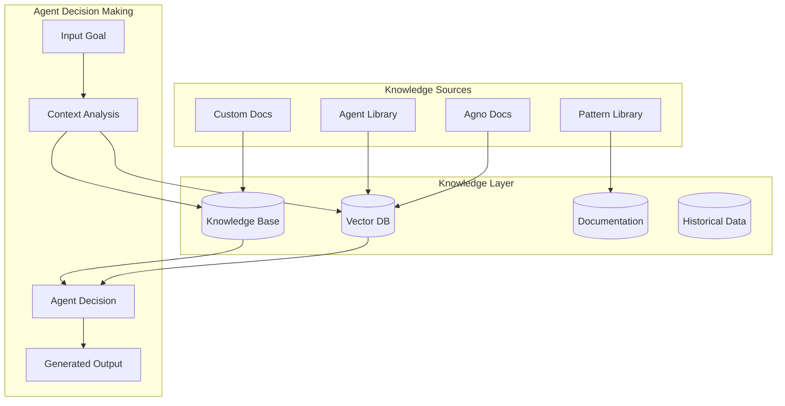

# 🧠 AgentForge Knowledge Systems Guide

Complete guide for integrating AgentForge with knowledge systems, vector databases, and semantic search capabilities.

## Table of Contents

- [Knowledge Systems Overview](#knowledge-systems-overview)
- [Vector Database Integration](#vector-database-integration)
- [Knowledge Base Setup](#knowledge-base-setup)
- [Semantic Search](#semantic-search)
- [Custom Knowledge Sources](#custom-knowledge-sources)
- [Agent Knowledge Integration](#agent-knowledge-integration)
- [Performance Optimization](#performance-optimization)
- [Troubleshooting](#troubleshooting)

## Knowledge Systems Overview

### What are Knowledge Systems?

Knowledge systems in AgentForge provide agents with access to:

- **Domain-specific documentation** - Technical docs, best practices, patterns
- **Historical data** - Previous agent implementations, successful patterns
- **Real-time information** - Dynamic data sources, APIs, databases
- **Contextual information** - Project-specific knowledge, constraints
- **External knowledge bases** - Industry standards, frameworks, libraries

### How AgentForge Uses Knowledge



### Knowledge Integration Architecture

AgentForge integrates knowledge at multiple levels:

1. **Agent-level knowledge** - Each agent has access to relevant domain knowledge
2. **Workflow-level knowledge** - Shared context across the entire workflow
3. **System-level knowledge** - Global knowledge about patterns and best practices
4. **External knowledge** - Real-time access to external data sources

## Vector Database Integration

### Supported Vector Databases

AgentForge supports multiple vector database backends through the Agno framework:

#### LanceDB (Recommended)
- **Local development** - File-based storage
- **Production** - Scalable vector storage
- **Performance** - High-performance similarity search
- **Integration** - Native Agno support

#### Chroma
- **Easy setup** - Simple configuration
- **Persistence** - Built-in persistence layer
- **Metadata** - Rich metadata support

#### Pinecone
- **Cloud native** - Fully managed service
- **Scalability** - Enterprise-scale vector search
- **Real-time** - Real-time indexing and queries

#### Weaviate
- **GraphQL API** - Flexible query interface
- **Multi-modal** - Support for various data types
- **Semantic** - Advanced semantic search capabilities

### Setting Up Vector Database

#### LanceDB Setup

```python
# knowledge/vector_setup.py
from agno.knowledge.knowledge import Knowledge
from agno.vectordb.lancedb import LanceDb, SearchType
from agno.embedder.openai import OpenAIEmbedder
import os

def create_lancedb_knowledge():
    """Create LanceDB-based knowledge system."""
    
    knowledge = Knowledge(
        vector_db=LanceDb(
            uri=os.getenv("VECTOR_DB_PATH", "./vector_db"),
            table_name="agentforge_knowledge",
            search_type=SearchType.hybrid,  # Hybrid search (vector + text)
            embedder=OpenAIEmbedder(
                id="text-embedding-3-small",
                api_key=os.getenv("OPENAI_API_KEY")
            ),
            distance="cosine"  # Similarity metric
        )
    )
    
    return knowledge

# Usage in agents
knowledge_base = create_lancedb_knowledge()
```

#### Chroma Setup

```python
from agno.vectordb.chroma import ChromaDb
from agno.knowledge.knowledge import Knowledge

def create_chroma_knowledge():
    """Create Chroma-based knowledge system."""
    
    knowledge = Knowledge(
        vector_db=ChromaDb(
            collection_name="agentforge_docs",
            path=os.getenv("CHROMA_DB_PATH", "./chroma_db"),
            embedder=OpenAIEmbedder(id="text-embedding-3-small")
        )
    )
    
    return knowledge
```

#### Pinecone Setup

```python
from agno.vectordb.pinecone import PineconeDb
from agno.knowledge.knowledge import Knowledge

def create_pinecone_knowledge():
    """Create Pinecone-based knowledge system."""
    
    knowledge = Knowledge(
        vector_db=PineconeDb(
            api_key=os.getenv("PINECONE_API_KEY"),
            index_name="agentforge-index",
            environment=os.getenv("PINECONE_ENVIRONMENT", "us-east1-gcp"),
            embedder=OpenAIEmbedder(id="text-embedding-3-small")
        )
    )
    
    return knowledge
```

### Indexing Knowledge Sources

#### Index Documentation

```python
# knowledge/indexing.py
import os
import asyncio
from pathlib import Path
from agno.knowledge.document import Document

async def index_documentation(knowledge: Knowledge, docs_path: str):
    """Index documentation files into vector database."""
    
    docs_dir = Path(docs_path)
    documents = []
    
    # Process markdown files
    for md_file in docs_dir.rglob("*.md"):
        with open(md_file, 'r', encoding='utf-8') as f:
            content = f.read()
            
        # Create document with metadata
        doc = Document(
            content=content,
            meta={
                "file_path": str(md_file),
                "file_name": md_file.name,
                "document_type": "documentation",
                "category": md_file.parent.name,
                "source": "local_docs"
            }
        )
        
        documents.append(doc)
    
    # Index documents
    await knowledge.aload_documents(documents)
    print(f"Indexed {len(documents)} documentation files")

# Usage
async def setup_knowledge_base():
    knowledge = create_lancedb_knowledge()
    
    # Index different types of documentation
    await index_documentation(knowledge, "./docs")
    await index_documentation(knowledge, "./agents")
    await index_documentation(knowledge, "./examples")
    
    return knowledge
```

#### Index Agent Library

```python
async def index_agent_library(knowledge: Knowledge, library_path: str):
    """Index agent library for semantic search."""
    
    library_dir = Path(library_path)
    documents = []
    
    for agent_file in library_dir.rglob("*.md"):
        with open(agent_file, 'r', encoding='utf-8') as f:
            content = f.read()
        
        # Extract agent metadata from content
        metadata = extract_agent_metadata(content)
        
        doc = Document(
            content=content,
            meta={
                "file_path": str(agent_file),
                "agent_name": metadata.get("name", agent_file.stem),
                "agent_type": metadata.get("type", "unknown"),
                "capabilities": metadata.get("capabilities", []),
                "domain": metadata.get("domain", "general"),
                "complexity": metadata.get("complexity", "medium"),
                "document_type": "agent_specification",
                "source": "agent_library"
            }
        )
        
        documents.append(doc)
    
    await knowledge.aload_documents(documents)
    print(f"Indexed {len(documents)} agent specifications")

def extract_agent_metadata(content: str) -> dict:
    """Extract metadata from agent markdown content."""
    
    metadata = {}
    lines = content.split('\n')
    
    for line in lines:
        if line.startswith('# '):
            metadata['name'] = line[2:].strip()
        elif 'Type:' in line:
            metadata['type'] = line.split('Type:')[1].strip()
        elif 'Domain:' in line:
            metadata['domain'] = line.split('Domain:')[1].strip()
        elif 'Capabilities:' in line:
            caps = line.split('Capabilities:')[1].strip()
            metadata['capabilities'] = [c.strip() for c in caps.split(',')]
    
    return metadata
```

#### Index External Knowledge

```python
async def index_external_knowledge(knowledge: Knowledge):
    """Index external knowledge sources."""
    
    # Index from APIs
    await index_from_api(knowledge, "https://api.example.com/docs")
    
    # Index from databases
    await index_from_database(knowledge, "postgresql://...")
    
    # Index from web sources
    await index_from_web(knowledge, ["https://docs.agno.com"])

async def index_from_api(knowledge: Knowledge, api_url: str):
    """Index knowledge from API endpoint."""
    
    import aiohttp
    
    async with aiohttp.ClientSession() as session:
        async with session.get(api_url) as response:
            data = await response.json()
            
        documents = []
        for item in data:
            doc = Document(
                content=item['content'],
                meta={
                    "source": "external_api",
                    "api_url": api_url,
                    "document_type": item.get('type', 'external'),
                    "timestamp": item.get('created_at'),
                    **item.get('metadata', {})
                }
            )
            documents.append(doc)
        
        await knowledge.aload_documents(documents)

async def index_from_web(knowledge: Knowledge, urls: list):
    """Index knowledge from web sources."""
    
    import aiohttp
    from bs4 import BeautifulSoup
    
    documents = []
    
    async with aiohttp.ClientSession() as session:
        for url in urls:
            try:
                async with session.get(url) as response:
                    html = await response.text()
                    
                soup = BeautifulSoup(html, 'html.parser')
                
                # Extract main content (customize based on site structure)
                content = soup.get_text(strip=True)
                
                doc = Document(
                    content=content,
                    meta={
                        "source": "web_scraping",
                        "url": url,
                        "title": soup.title.string if soup.title else url,
                        "document_type": "web_content"
                    }
                )
                
                documents.append(doc)
                
            except Exception as e:
                print(f"Failed to index {url}: {e}")
    
    await knowledge.aload_documents(documents)
```

## Knowledge Base Setup

### Configuration

```python
# config/knowledge_config.py
from pydantic import BaseSettings
from typing import List, Optional, Dict, Any

class KnowledgeConfig(BaseSettings):
    """Knowledge system configuration."""
    
    # Vector database settings
    vector_db_type: str = "lancedb"  # lancedb, chroma, pinecone, weaviate
    vector_db_path: str = "./vector_db"
    vector_table_name: str = "agentforge_knowledge"
    
    # Embedding settings
    embedding_model: str = "text-embedding-3-small"
    embedding_dimensions: int = 1536
    
    # Search settings
    search_type: str = "hybrid"  # vector, text, hybrid
    similarity_threshold: float = 0.7
    max_search_results: int = 10
    
    # Knowledge sources
    documentation_paths: List[str] = ["./docs", "./agents", "./examples"]
    agent_library_path: str = "./agent_library"
    external_knowledge_sources: List[str] = []
    
    # Indexing settings
    chunk_size: int = 1000
    chunk_overlap: int = 200
    batch_size: int = 100
    
    # API settings
    openai_api_key: str
    pinecone_api_key: Optional[str] = None
    pinecone_environment: Optional[str] = None
    
    class Config:
        env_file = ".env"
        case_sensitive = False

knowledge_config = KnowledgeConfig()
```

### Knowledge Manager

```python
# knowledge/manager.py
from typing import List, Dict, Any, Optional
import asyncio
import logging

class KnowledgeManager:
    """Centralized knowledge management for AgentForge."""
    
    def __init__(self, config: KnowledgeConfig):
        self.config = config
        self.knowledge_bases: Dict[str, Knowledge] = {}
        self.logger = logging.getLogger(__name__)
        
        # Initialize knowledge bases
        asyncio.create_task(self._initialize_knowledge_bases())
    
    async def _initialize_knowledge_bases(self):
        """Initialize different knowledge bases."""
        
        # Main documentation knowledge base
        self.knowledge_bases["docs"] = await self._create_docs_knowledge()
        
        # Agent library knowledge base
        self.knowledge_bases["agents"] = await self._create_agents_knowledge()
        
        # Patterns and examples knowledge base
        self.knowledge_bases["patterns"] = await self._create_patterns_knowledge()
        
        # External knowledge base
        if self.config.external_knowledge_sources:
            self.knowledge_bases["external"] = await self._create_external_knowledge()
    
    async def _create_docs_knowledge(self) -> Knowledge:
        """Create documentation knowledge base."""
        
        knowledge = Knowledge(
            vector_db=self._create_vector_db("docs_knowledge"),
        )
        
        # Index all documentation
        for docs_path in self.config.documentation_paths:
            await index_documentation(knowledge, docs_path)
        
        return knowledge
    
    async def _create_agents_knowledge(self) -> Knowledge:
        """Create agent library knowledge base."""
        
        knowledge = Knowledge(
            vector_db=self._create_vector_db("agents_knowledge"),
        )
        
        # Index agent library
        if os.path.exists(self.config.agent_library_path):
            await index_agent_library(knowledge, self.config.agent_library_path)
        
        return knowledge
    
    def _create_vector_db(self, table_name: str):
        """Create vector database instance."""
        
        if self.config.vector_db_type == "lancedb":
            return LanceDb(
                uri=self.config.vector_db_path,
                table_name=table_name,
                search_type=SearchType.hybrid,
                embedder=OpenAIEmbedder(
                    id=self.config.embedding_model,
                    api_key=self.config.openai_api_key
                )
            )
        elif self.config.vector_db_type == "chroma":
            return ChromaDb(
                collection_name=table_name,
                path=self.config.vector_db_path,
                embedder=OpenAIEmbedder(id=self.config.embedding_model)
            )
        # Add other vector DB types as needed
        else:
            raise ValueError(f"Unsupported vector DB type: {self.config.vector_db_type}")
    
    async def search_knowledge(
        self,
        query: str,
        knowledge_type: str = "all",
        max_results: int = None
    ) -> List[Dict[str, Any]]:
        """Search across knowledge bases."""
        
        max_results = max_results or self.config.max_search_results
        results = []
        
        # Determine which knowledge bases to search
        if knowledge_type == "all":
            knowledge_bases = self.knowledge_bases.values()
        elif knowledge_type in self.knowledge_bases:
            knowledge_bases = [self.knowledge_bases[knowledge_type]]
        else:
            raise ValueError(f"Unknown knowledge type: {knowledge_type}")
        
        # Search each knowledge base
        for kb in knowledge_bases:
            try:
                kb_results = await kb.asearch(query, num_documents=max_results)
                
                for result in kb_results:
                    results.append({
                        "content": result.content,
                        "metadata": result.meta,
                        "score": getattr(result, "score", 1.0)
                    })
                    
            except Exception as e:
                self.logger.error(f"Knowledge search failed: {e}")
        
        # Sort by relevance score and limit results
        results.sort(key=lambda x: x["score"], reverse=True)
        return results[:max_results]
    
    async def add_knowledge(
        self,
        content: str,
        metadata: Dict[str, Any],
        knowledge_type: str = "docs"
    ):
        """Add new knowledge to specified knowledge base."""
        
        if knowledge_type not in self.knowledge_bases:
            raise ValueError(f"Unknown knowledge type: {knowledge_type}")
        
        doc = Document(content=content, meta=metadata)
        await self.knowledge_bases[knowledge_type].aload_documents([doc])
    
    async def update_knowledge_base(self, knowledge_type: str):
        """Update specific knowledge base with latest data."""
        
        if knowledge_type == "docs":
            await self._create_docs_knowledge()
        elif knowledge_type == "agents":
            await self._create_agents_knowledge()
        # Add other types as needed
```

## Semantic Search

### Advanced Search Capabilities

```python
# knowledge/search.py
from typing import List, Dict, Any, Optional
import re
from dataclasses import dataclass

@dataclass
class SearchResult:
    content: str
    metadata: Dict[str, Any]
    score: float
    highlights: List[str] = None

class SemanticSearchEngine:
    """Advanced semantic search for AgentForge knowledge."""
    
    def __init__(self, knowledge_manager: KnowledgeManager):
        self.knowledge_manager = knowledge_manager
    
    async def semantic_search(
        self,
        query: str,
        filters: Dict[str, Any] = None,
        knowledge_types: List[str] = None,
        include_highlights: bool = True,
        rerank_results: bool = True
    ) -> List[SearchResult]:
        """Perform semantic search with advanced features."""
        
        # Process query
        processed_query = self._preprocess_query(query)
        
        # Search across knowledge bases
        knowledge_types = knowledge_types or ["all"]
        all_results = []
        
        for kb_type in knowledge_types:
            results = await self.knowledge_manager.search_knowledge(
                processed_query,
                knowledge_type=kb_type
            )
            all_results.extend(results)
        
        # Apply filters
        if filters:
            all_results = self._apply_filters(all_results, filters)
        
        # Add highlights
        if include_highlights:
            all_results = self._add_highlights(all_results, query)
        
        # Rerank results
        if rerank_results:
            all_results = await self._rerank_results(all_results, query)
        
        # Convert to SearchResult objects
        search_results = [
            SearchResult(
                content=r["content"],
                metadata=r["metadata"],
                score=r["score"],
                highlights=r.get("highlights", [])
            )
            for r in all_results
        ]
        
        return search_results
    
    def _preprocess_query(self, query: str) -> str:
        """Preprocess search query."""
        
        # Expand abbreviations
        abbreviations = {
            "API": "Application Programming Interface",
            "DB": "Database",
            "ML": "Machine Learning",
            "AI": "Artificial Intelligence"
        }
        
        for abbr, full in abbreviations.items():
            query = re.sub(rf'\b{abbr}\b', f"{abbr} {full}", query, flags=re.IGNORECASE)
        
        # Add domain context if needed
        if "agent" not in query.lower():
            query = f"{query} agent development"
        
        return query
    
    def _apply_filters(self, results: List[Dict], filters: Dict[str, Any]) -> List[Dict]:
        """Apply metadata filters to search results."""
        
        filtered_results = []
        
        for result in results:
            metadata = result.get("metadata", {})
            include_result = True
            
            for filter_key, filter_value in filters.items():
                meta_value = metadata.get(filter_key)
                
                if isinstance(filter_value, list):
                    if meta_value not in filter_value:
                        include_result = False
                        break
                elif isinstance(filter_value, str):
                    if filter_value.lower() not in str(meta_value).lower():
                        include_result = False
                        break
                elif meta_value != filter_value:
                    include_result = False
                    break
            
            if include_result:
                filtered_results.append(result)
        
        return filtered_results
    
    def _add_highlights(self, results: List[Dict], query: str) -> List[Dict]:
        """Add text highlights to search results."""
        
        query_terms = query.lower().split()
        
        for result in results:
            content = result["content"]
            highlights = []
            
            # Find sentences containing query terms
            sentences = re.split(r'[.!?]+', content)
            
            for sentence in sentences:
                sentence_lower = sentence.lower()
                
                # Check if sentence contains query terms
                if any(term in sentence_lower for term in query_terms):
                    # Highlight the matching terms
                    highlighted_sentence = sentence
                    for term in query_terms:
                        pattern = re.compile(re.escape(term), re.IGNORECASE)
                        highlighted_sentence = pattern.sub(
                            f"**{term}**", 
                            highlighted_sentence
                        )
                    
                    highlights.append(highlighted_sentence.strip())
            
            result["highlights"] = highlights[:3]  # Limit to top 3 highlights
        
        return results
    
    async def _rerank_results(self, results: List[Dict], query: str) -> List[Dict]:
        """Rerank results based on additional relevance signals."""
        
        for result in results:
            score = result["score"]
            metadata = result.get("metadata", {})
            
            # Boost recent documents
            if "timestamp" in metadata:
                # Implement time-based boosting
                pass
            
            # Boost by document type relevance
            doc_type = metadata.get("document_type", "")
            if doc_type == "agent_specification":
                score *= 1.2  # Boost agent specs
            elif doc_type == "documentation":
                score *= 1.1  # Boost documentation
            
            # Boost by domain relevance
            domain = metadata.get("domain", "")
            if any(term in query.lower() for term in domain.lower().split()):
                score *= 1.15
            
            result["score"] = score
        
        # Sort by updated scores
        results.sort(key=lambda x: x["score"], reverse=True)
        return results

# Advanced search patterns
class SearchPatterns:
    """Common search patterns for AgentForge knowledge."""
    
    @staticmethod
    async def find_similar_agents(
        search_engine: SemanticSearchEngine,
        requirements: Dict[str, Any]
    ) -> List[SearchResult]:
        """Find agents similar to requirements."""
        
        # Build search query from requirements
        query_parts = []
        if "domain" in requirements:
            query_parts.append(requirements["domain"])
        if "capabilities" in requirements:
            query_parts.extend(requirements["capabilities"])
        if "role" in requirements:
            query_parts.append(requirements["role"])
        
        query = " ".join(query_parts)
        
        # Search agent knowledge
        return await search_engine.semantic_search(
            query,
            knowledge_types=["agents"],
            filters={
                "document_type": "agent_specification",
                "domain": requirements.get("domain")
            }
        )
    
    @staticmethod
    async def find_implementation_patterns(
        search_engine: SemanticSearchEngine,
        technology: str,
        pattern_type: str
    ) -> List[SearchResult]:
        """Find implementation patterns for specific technologies."""
        
        query = f"{technology} {pattern_type} implementation examples"
        
        return await search_engine.semantic_search(
            query,
            knowledge_types=["patterns", "docs"],
            filters={
                "document_type": ["pattern", "example", "documentation"]
            }
        )
    
    @staticmethod
    async def find_troubleshooting_solutions(
        search_engine: SemanticSearchEngine,
        error_message: str,
        context: str = None
    ) -> List[SearchResult]:
        """Find solutions for specific errors or issues."""
        
        query = f"error troubleshooting {error_message}"
        if context:
            query += f" {context}"
        
        return await search_engine.semantic_search(
            query,
            knowledge_types=["docs"],
            filters={
                "document_type": ["troubleshooting", "faq", "documentation"]
            }
        )
```

## Custom Knowledge Sources

### Creating Custom Knowledge Providers

```python
# knowledge/custom_providers.py
from abc import ABC, abstractmethod
from typing import List, Dict, Any, AsyncGenerator
import asyncio

class KnowledgeProvider(ABC):
    """Base class for custom knowledge providers."""
    
    @abstractmethod
    async def fetch_documents(self) -> AsyncGenerator[Document, None]:
        """Fetch documents from the knowledge source."""
        pass
    
    @abstractmethod
    async def search(self, query: str, **kwargs) -> List[Dict[str, Any]]:
        """Search within the knowledge source."""
        pass
    
    @property
    @abstractmethod
    def provider_type(self) -> str:
        """Type identifier for this provider."""
        pass

class DatabaseKnowledgeProvider(KnowledgeProvider):
    """Knowledge provider for database sources."""
    
    def __init__(self, connection_string: str, table_name: str):
        self.connection_string = connection_string
        self.table_name = table_name
    
    @property
    def provider_type(self) -> str:
        return "database"
    
    async def fetch_documents(self) -> AsyncGenerator[Document, None]:
        """Fetch documents from database."""
        
        import asyncpg
        
        conn = await asyncpg.connect(self.connection_string)
        
        try:
            query = f"""
                SELECT id, content, metadata, created_at 
                FROM {self.table_name}
                WHERE content IS NOT NULL
                ORDER BY created_at DESC
            """
            
            async for record in conn.cursor(query):
                yield Document(
                    content=record["content"],
                    meta={
                        "id": record["id"],
                        "source": "database",
                        "table": self.table_name,
                        "created_at": record["created_at"].isoformat(),
                        **record.get("metadata", {})
                    }
                )
        
        finally:
            await conn.close()
    
    async def search(self, query: str, **kwargs) -> List[Dict[str, Any]]:
        """Search database using full-text search."""
        
        import asyncpg
        
        conn = await asyncpg.connect(self.connection_string)
        results = []
        
        try:
            # Use PostgreSQL full-text search
            sql_query = f"""
                SELECT content, metadata, ts_rank_cd(to_tsvector(content), query) as rank
                FROM {self.table_name}, plainto_tsquery($1) query
                WHERE to_tsvector(content) @@ query
                ORDER BY rank DESC
                LIMIT $2
            """
            
            records = await conn.fetch(
                sql_query, 
                query, 
                kwargs.get("limit", 10)
            )
            
            for record in records:
                results.append({
                    "content": record["content"],
                    "metadata": record["metadata"] or {},
                    "score": float(record["rank"])
                })
        
        finally:
            await conn.close()
        
        return results

class APIKnowledgeProvider(KnowledgeProvider):
    """Knowledge provider for REST APIs."""
    
    def __init__(self, base_url: str, api_key: str = None):
        self.base_url = base_url
        self.api_key = api_key
        self.headers = {}
        
        if api_key:
            self.headers["Authorization"] = f"Bearer {api_key}"
    
    @property
    def provider_type(self) -> str:
        return "api"
    
    async def fetch_documents(self) -> AsyncGenerator[Document, None]:
        """Fetch documents from API."""
        
        import aiohttp
        
        async with aiohttp.ClientSession() as session:
            async with session.get(
                f"{self.base_url}/documents",
                headers=self.headers
            ) as response:
                data = await response.json()
                
                for item in data.get("documents", []):
                    yield Document(
                        content=item["content"],
                        meta={
                            "id": item.get("id"),
                            "source": "api",
                            "api_url": self.base_url,
                            **item.get("metadata", {})
                        }
                    )
    
    async def search(self, query: str, **kwargs) -> List[Dict[str, Any]]:
        """Search via API endpoint."""
        
        import aiohttp
        
        async with aiohttp.ClientSession() as session:
            params = {
                "query": query,
                "limit": kwargs.get("limit", 10)
            }
            
            async with session.get(
                f"{self.base_url}/search",
                params=params,
                headers=self.headers
            ) as response:
                data = await response.json()
                
                return data.get("results", [])

class FileSystemKnowledgeProvider(KnowledgeProvider):
    """Knowledge provider for file system sources."""
    
    def __init__(self, root_path: str, file_patterns: List[str] = None):
        self.root_path = Path(root_path)
        self.file_patterns = file_patterns or ["*.md", "*.txt", "*.rst"]
    
    @property
    def provider_type(self) -> str:
        return "filesystem"
    
    async def fetch_documents(self) -> AsyncGenerator[Document, None]:
        """Fetch documents from file system."""
        
        for pattern in self.file_patterns:
            for file_path in self.root_path.rglob(pattern):
                if file_path.is_file():
                    try:
                        with open(file_path, 'r', encoding='utf-8') as f:
                            content = f.read()
                        
                        yield Document(
                            content=content,
                            meta={
                                "file_path": str(file_path),
                                "file_name": file_path.name,
                                "file_type": file_path.suffix[1:],
                                "source": "filesystem",
                                "directory": file_path.parent.name
                            }
                        )
                    
                    except Exception as e:
                        print(f"Failed to read {file_path}: {e}")
    
    async def search(self, query: str, **kwargs) -> List[Dict[str, Any]]:
        """Simple text search in files."""
        
        results = []
        query_lower = query.lower()
        
        async for doc in self.fetch_documents():
            content_lower = doc.content.lower()
            
            if query_lower in content_lower:
                # Calculate simple relevance score
                score = content_lower.count(query_lower) / len(content_lower.split())
                
                results.append({
                    "content": doc.content,
                    "metadata": doc.meta,
                    "score": score
                })
        
        # Sort by relevance
        results.sort(key=lambda x: x["score"], reverse=True)
        return results[:kwargs.get("limit", 10)]

# Knowledge provider registry
class KnowledgeProviderRegistry:
    """Registry for custom knowledge providers."""
    
    def __init__(self):
        self.providers: Dict[str, KnowledgeProvider] = {}
    
    def register_provider(self, name: str, provider: KnowledgeProvider):
        """Register a knowledge provider."""
        self.providers[name] = provider
    
    def get_provider(self, name: str) -> KnowledgeProvider:
        """Get a registered provider."""
        return self.providers.get(name)
    
    async def search_all_providers(
        self, 
        query: str, 
        provider_names: List[str] = None
    ) -> Dict[str, List[Dict[str, Any]]]:
        """Search across multiple providers."""
        
        if provider_names is None:
            provider_names = list(self.providers.keys())
        
        results = {}
        
        for name in provider_names:
            if name in self.providers:
                try:
                    provider_results = await self.providers[name].search(query)
                    results[name] = provider_results
                except Exception as e:
                    print(f"Search failed for provider {name}: {e}")
                    results[name] = []
        
        return results
```

## Agent Knowledge Integration

### Knowledge-Enhanced Agents

```python
# agents/knowledge_enhanced_agent.py
from typing import List, Dict, Any, Optional

class KnowledgeEnhancedAgent:
    """Base class for agents with knowledge system integration."""
    
    def __init__(
        self,
        name: str,
        knowledge_manager: KnowledgeManager,
        knowledge_types: List[str] = None,
        **kwargs
    ):
        self.name = name
        self.knowledge_manager = knowledge_manager
        self.knowledge_types = knowledge_types or ["docs", "agents"]
        
        # Create knowledge tools
        self.knowledge_tools = [
            KnowledgeTools(knowledge=knowledge_manager.knowledge_bases[kt])
            for kt in self.knowledge_types
            if kt in knowledge_manager.knowledge_bases
        ]
        
        # Initialize agent with knowledge tools
        self.agent = Agent(
            name=name,
            tools=self.knowledge_tools + kwargs.get("tools", []),
            **kwargs
        )
    
    async def search_knowledge(
        self,
        query: str,
        knowledge_type: str = "all",
        max_results: int = 5
    ) -> List[Dict[str, Any]]:
        """Search knowledge base for relevant information."""
        
        return await self.knowledge_manager.search_knowledge(
            query=query,
            knowledge_type=knowledge_type,
            max_results=max_results
        )
    
    async def get_contextual_knowledge(
        self,
        context: Dict[str, Any]
    ) -> str:
        """Get contextual knowledge based on current context."""
        
        # Build search queries from context
        queries = []
        
        if "domain" in context:
            queries.append(f"{context['domain']} best practices")
        
        if "goal" in context:
            queries.append(f"{context['goal']} implementation patterns")
        
        if "constraints" in context:
            for constraint in context.get("constraints", []):
                queries.append(f"{constraint} considerations")
        
        # Search for relevant knowledge
        all_results = []
        for query in queries:
            results = await self.search_knowledge(query, max_results=3)
            all_results.extend(results)
        
        # Format knowledge for agent consumption
        knowledge_context = self._format_knowledge_context(all_results)
        return knowledge_context
    
    def _format_knowledge_context(self, results: List[Dict[str, Any]]) -> str:
        """Format knowledge results for agent context."""
        
        if not results:
            return "No relevant knowledge found."
        
        formatted_parts = ["RELEVANT KNOWLEDGE:", ""]
        
        for i, result in enumerate(results[:5], 1):  # Limit to top 5 results
            content = result["content"][:500]  # Truncate long content
            source = result["metadata"].get("source", "unknown")
            
            formatted_parts.extend([
                f"{i}. From {source}:",
                content,
                ""
            ])
        
        return "\n".join(formatted_parts)

# Enhanced Systems Analyst with Knowledge
class KnowledgeEnhancedSystemsAnalyst(KnowledgeEnhancedAgent):
    """Systems Analyst with knowledge system integration."""
    
    def __init__(self, knowledge_manager: KnowledgeManager, **kwargs):
        super().__init__(
            name="Knowledge Enhanced Systems Analyst",
            knowledge_manager=knowledge_manager,
            knowledge_types=["docs", "patterns"],
            **kwargs
        )
    
    async def analyze_goal_with_knowledge(
        self,
        input_goal: InputGoal
    ) -> StrategyDocument:
        """Analyze goal using knowledge-enhanced approach."""
        
        # Get relevant knowledge
        knowledge_context = await self.get_contextual_knowledge({
            "domain": input_goal.domain,
            "goal": input_goal.goal_description,
            "constraints": input_goal.constraints
        })
        
        # Enhanced prompt with knowledge
        enhanced_prompt = f"""
        Analyze this goal with the following relevant knowledge context:
        
        {knowledge_context}
        
        GOAL TO ANALYZE:
        - Description: {input_goal.goal_description}
        - Domain: {input_goal.domain}
        - Complexity: {input_goal.complexity_level}
        - Constraints: {input_goal.constraints}
        - Success Criteria: {input_goal.success_criteria}
        
        Based on the knowledge context and goal details, provide a comprehensive analysis
        that leverages established patterns and best practices.
        """
        
        result = await self.agent.arun(message=enhanced_prompt)
        
        # Parse and return structured result
        return self._parse_strategy_result(result.content)
```

## Performance Optimization

### Indexing Optimization

```python
# knowledge/optimization.py
import asyncio
from typing import List, Dict, Any
import time

class KnowledgeIndexOptimizer:
    """Optimize knowledge indexing performance."""
    
    def __init__(self, knowledge_manager: KnowledgeManager):
        self.knowledge_manager = knowledge_manager
    
    async def optimize_indexing(
        self,
        documents: List[Document],
        batch_size: int = 100,
        max_concurrent: int = 5
    ):
        """Optimize document indexing with batching and concurrency."""
        
        # Split documents into batches
        batches = [
            documents[i:i + batch_size]
            for i in range(0, len(documents), batch_size)
        ]
        
        # Process batches concurrently
        semaphore = asyncio.Semaphore(max_concurrent)
        
        async def process_batch(batch: List[Document], batch_idx: int):
            async with semaphore:
                start_time = time.time()
                
                try:
                    # Index batch
                    await self.knowledge_manager.knowledge_bases["docs"].aload_documents(batch)
                    
                    processing_time = time.time() - start_time
                    print(f"Batch {batch_idx + 1}/{len(batches)} processed in {processing_time:.2f}s")
                    
                except Exception as e:
                    print(f"Batch {batch_idx + 1} failed: {e}")
        
        # Process all batches
        tasks = [
            process_batch(batch, idx)
            for idx, batch in enumerate(batches)
        ]
        
        await asyncio.gather(*tasks)
        
        print(f"Indexed {len(documents)} documents in {len(batches)} batches")

class SearchOptimizer:
    """Optimize search performance."""
    
    def __init__(self, knowledge_manager: KnowledgeManager):
        self.knowledge_manager = knowledge_manager
        self.query_cache: Dict[str, Any] = {}
        self.cache_ttl = 300  # 5 minutes
    
    async def cached_search(
        self,
        query: str,
        knowledge_type: str = "all",
        max_results: int = 10
    ) -> List[Dict[str, Any]]:
        """Search with caching for improved performance."""
        
        # Create cache key
        cache_key = f"{query}:{knowledge_type}:{max_results}"
        
        # Check cache
        if cache_key in self.query_cache:
            cached_item = self.query_cache[cache_key]
            if time.time() - cached_item["timestamp"] < self.cache_ttl:
                return cached_item["results"]
            else:
                # Remove expired cache entry
                del self.query_cache[cache_key]
        
        # Perform search
        results = await self.knowledge_manager.search_knowledge(
            query=query,
            knowledge_type=knowledge_type,
            max_results=max_results
        )
        
        # Cache results
        self.query_cache[cache_key] = {
            "results": results,
            "timestamp": time.time()
        }
        
        return results
    
    async def parallel_search(
        self,
        queries: List[str],
        knowledge_type: str = "all"
    ) -> Dict[str, List[Dict[str, Any]]]:
        """Perform multiple searches in parallel."""
        
        async def search_single(query: str):
            return await self.cached_search(query, knowledge_type)
        
        # Execute searches in parallel
        results = await asyncio.gather(
            *[search_single(query) for query in queries]
        )
        
        # Return as dictionary
        return {
            query: result
            for query, result in zip(queries, results)
        }
```

## Troubleshooting

### Common Knowledge System Issues

#### Vector Database Connection Issues

**Problem**: Cannot connect to vector database

**Solutions**:
1. Check database path/URL is correct
2. Verify database is running (for external DBs)
3. Check network connectivity
4. Validate credentials and permissions

```python
# Test vector database connection
async def test_vector_db_connection():
    try:
        knowledge = create_lancedb_knowledge()
        
        # Try a simple operation
        test_doc = Document(content="test", meta={"test": True})
        await knowledge.aload_documents([test_doc])
        
        print("Vector database connection successful")
        return True
        
    except Exception as e:
        print(f"Vector database connection failed: {e}")
        return False
```

#### Indexing Performance Issues

**Problem**: Document indexing is slow

**Solutions**:
1. Increase batch size for bulk indexing
2. Use concurrent processing
3. Optimize document preprocessing
4. Check vector database configuration

```python
# Optimize indexing performance
async def optimize_indexing_performance():
    # Use larger batch sizes
    batch_size = 200  # Increase from default
    
    # Process multiple batches concurrently
    max_concurrent = 10
    
    # Optimize document chunking
    chunk_size = 1500  # Increase chunk size
    chunk_overlap = 100  # Reduce overlap
```

#### Search Quality Issues

**Problem**: Search results are not relevant

**Solutions**:
1. Improve query preprocessing
2. Adjust similarity thresholds
3. Use hybrid search (vector + text)
4. Add metadata filters
5. Implement result reranking

```python
# Improve search quality
async def improve_search_quality():
    # Use hybrid search
    search_type = SearchType.hybrid
    
    # Adjust similarity threshold
    similarity_threshold = 0.8  # Increase for more relevant results
    
    # Add query expansion
    expanded_query = expand_query_with_synonyms(original_query)
    
    # Use metadata filters
    filters = {
        "document_type": ["documentation", "agent_specification"],
        "domain": target_domain
    }
```

#### Memory Usage Issues

**Problem**: High memory usage during indexing/search

**Solutions**:
1. Reduce batch sizes
2. Clear caches periodically
3. Use streaming for large datasets
4. Optimize embedding dimensions

```python
# Memory optimization
async def optimize_memory_usage():
    # Smaller batch sizes
    batch_size = 50
    
    # Clear caches periodically
    if len(query_cache) > 1000:
        query_cache.clear()
    
    # Use streaming for large files
    async def stream_large_documents():
        # Process documents one at a time
        pass
```

### Debugging Tools

```python
# knowledge/debug.py
import logging
import json
from typing import Dict, Any

class KnowledgeDebugger:
    """Debug knowledge system issues."""
    
    def __init__(self, knowledge_manager: KnowledgeManager):
        self.knowledge_manager = knowledge_manager
        self.logger = logging.getLogger(__name__)
    
    async def debug_search_query(
        self,
        query: str,
        knowledge_type: str = "all"
    ) -> Dict[str, Any]:
        """Debug search query execution."""
        
        debug_info = {
            "query": query,
            "knowledge_type": knowledge_type,
            "preprocessing": {},
            "search_results": {},
            "performance": {}
        }
        
        start_time = time.time()
        
        # Debug query preprocessing
        processed_query = self._debug_query_preprocessing(query)
        debug_info["preprocessing"] = processed_query
        
        # Execute search with debugging
        try:
            results = await self.knowledge_manager.search_knowledge(
                query, knowledge_type
            )
            
            debug_info["search_results"] = {
                "count": len(results),
                "top_scores": [r.get("score", 0) for r in results[:5]],
                "sources": list(set(r["metadata"].get("source", "unknown") for r in results))
            }
            
        except Exception as e:
            debug_info["error"] = str(e)
            self.logger.error(f"Search debug failed: {e}")
        
        debug_info["performance"]["total_time"] = time.time() - start_time
        
        return debug_info
    
    def _debug_query_preprocessing(self, query: str) -> Dict[str, Any]:
        """Debug query preprocessing steps."""
        
        return {
            "original": query,
            "lowercased": query.lower(),
            "tokens": query.split(),
            "length": len(query)
        }
    
    async def debug_knowledge_base_health(self) -> Dict[str, Any]:
        """Check knowledge base health."""
        
        health_info = {}
        
        for kb_name, kb in self.knowledge_manager.knowledge_bases.items():
            try:
                # Basic health check
                test_results = await kb.asearch("test query", num_documents=1)
                
                health_info[kb_name] = {
                    "status": "healthy",
                    "can_search": True,
                    "test_results_count": len(test_results)
                }
                
            except Exception as e:
                health_info[kb_name] = {
                    "status": "unhealthy",
                    "error": str(e)
                }
        
        return health_info
```

---

This comprehensive knowledge systems guide provides everything needed to effectively integrate and manage knowledge sources in AgentForge. For additional support, refer to the [main documentation](README.md) or reach out to the community.