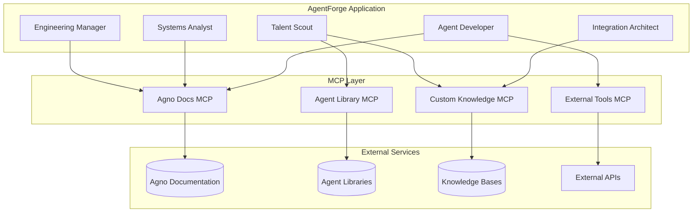

# 🔗 AgentForge MCP Integration Guide

Complete guide for integrating AgentForge with Model Context Protocol (MCP) servers and services.

## Table of Contents

- [MCP Overview](#mcp-overview)
- [AgentForge MCP Integration](#agentforge-mcp-integration)
- [Setting Up MCP Servers](#setting-up-mcp-servers)
- [Configuration](#configuration)
- [Available MCP Services](#available-mcp-services)
- [Custom MCP Implementations](#custom-mcp-implementations)
- [Troubleshooting](#troubleshooting)

## MCP Overview

### What is Model Context Protocol (MCP)?

Model Context Protocol (MCP) is a standard for connecting AI assistants with external data sources and tools. It enables:

- **Secure data access** with proper authentication
- **Standardized interfaces** for different data sources
- **Real-time data integration** for AI agents
- **Contextual information** for better AI responses

### How AgentForge Uses MCP

AgentForge leverages MCP for:

1. **Agno Documentation Access** - Real-time access to Agno framework docs
2. **Agent Library Scanning** - Dynamic discovery of existing agents  
3. **Knowledge Base Integration** - Access to custom knowledge repositories
4. **External Tool Integration** - Connection to external APIs and services
5. **Real-time Data Access** - Dynamic data for agent decision-making

## AgentForge MCP Integration

### Core MCP Components

AgentForge integrates MCP at multiple levels:



### MCP Configuration in Agents

Each AgentForge agent can be configured with MCP tools:

```python
# agents/systems_analyst.py
from agno.tools.mcp import MCPTools, StreamableHTTPClientParams

class SystemsAnalyst:
    def __init__(self, **kwargs):
        # Configure MCP connection
        self.mcp_params = StreamableHTTPClientParams(
            url="https://mcp.delo.sh/metamcp/agno/mcp",
            headers={"Authorization": f"Bearer {getenv('MCP_API_KEY')}"},
            terminate_on_close=True
        )
        
        # Initialize agent with MCP tools
        self.agent = Agent(
            name="Systems Analyst",
            tools=[MCPTools(self.mcp_params)],
            # ... other configuration
        )
```

## Setting Up MCP Servers

### Agno Documentation MCP Server

The Agno documentation MCP server provides real-time access to Agno framework documentation.

#### Configuration

```python
# MCP server for Agno documentation
AGNO_DOCS_MCP = {
    "url": "https://mcp.delo.sh/metamcp/agno/mcp",
    "headers": {
        "Authorization": f"Bearer {getenv('MCP_API_KEY')}",
        "Content-Type": "application/json"
    },
    "timeout": 30,
    "max_retries": 3
}
```

#### Available Resources

The Agno docs MCP server provides access to:

- **Core Concepts** - Agent, Workflow, Tools documentation
- **API Reference** - Complete API documentation
- **Examples** - Code examples and patterns
- **Best Practices** - Implementation guidelines
- **Integration Patterns** - Common integration approaches

#### Usage Example

```python
async def get_agno_documentation(query: str):
    """Get relevant Agno documentation via MCP."""
    
    async with MCPTools(agno_mcp_params) as mcp:
        # Search documentation
        search_result = await mcp.call_tool(
            "search_docs",
            {
                "query": query,
                "max_results": 5,
                "include_examples": True
            }
        )
        
        return search_result
```

### Agent Library MCP Server

Provides dynamic access to agent libraries for the Talent Scout.

#### Configuration

```python
# Agent library MCP configuration
AGENT_LIBRARY_MCP = {
    "url": "https://mcp.delo.sh/metamcp/agentforge/mcp",
    "headers": {
        "Authorization": f"Bearer {getenv('MCP_API_KEY')}",
        "X-Library-Path": getenv('AGENT_LIBRARY_PATH', '/default/path')
    },
    "capabilities": [
        "scan_library",
        "semantic_search", 
        "agent_analysis",
        "capability_matching"
    ]
}
```

#### Available Operations

- **scan_library** - Discover all agents in library
- **semantic_search** - Find agents by capability
- **agent_analysis** - Analyze agent specifications
- **capability_matching** - Match agents to requirements

#### Usage Example

```python
async def scan_agent_library(library_path: str):
    """Scan agent library via MCP."""
    
    async with MCPTools(agent_library_mcp_params) as mcp:
        result = await mcp.call_tool(
            "scan_library",
            {
                "path": library_path,
                "include_metadata": True,
                "recursive": True
            }
        )
        
        return result
```

## Configuration

### Environment Variables

Set up MCP integration with environment variables:

```bash
# MCP API Configuration
MCP_API_KEY=your_mcp_api_key_here
MCP_BASE_URL=https://mcp.delo.sh/metamcp

# Agent Library Configuration  
AGENT_LIBRARY_PATH=/path/to/your/agents
TEAMS_LIBRARY_PATH=/path/to/your/teams

# Knowledge Base Configuration
KNOWLEDGE_BASE_URL=https://your-knowledge-base.com/api
KNOWLEDGE_BASE_API_KEY=your_kb_api_key

# MCP Connection Settings
MCP_TIMEOUT=30
MCP_MAX_RETRIES=3
MCP_CONNECTION_POOL_SIZE=10
```

### Application Configuration

Configure MCP in your AgentForge application:

```python
# config/mcp_config.py
from pydantic import BaseSettings
from typing import Dict, List, Optional

class MCPConfig(BaseSettings):
    """MCP integration configuration."""
    
    # Core MCP settings
    mcp_api_key: str
    mcp_base_url: str = "https://mcp.delo.sh/metamcp"
    
    # Connection settings
    mcp_timeout: int = 30
    mcp_max_retries: int = 3
    mcp_pool_size: int = 10
    
    # Service endpoints
    agno_docs_endpoint: str = "/agno/mcp"
    agent_library_endpoint: str = "/agentforge/mcp"
    knowledge_base_endpoint: str = "/knowledge/mcp"
    
    # Agent library configuration
    agent_library_path: str = "/default/agents"
    teams_library_path: str = "/default/teams"
    
    # Knowledge base settings
    knowledge_base_url: Optional[str] = None
    knowledge_base_api_key: Optional[str] = None
    
    class Config:
        env_file = ".env"
        case_sensitive = False

mcp_config = MCPConfig()
```

### Agent-Specific MCP Setup

Configure MCP for each agent type:

```python
# agents/mcp_enabled_agent.py
from agno.tools.mcp import MCPTools, StreamableHTTPClientParams
from typing import List, Dict, Any

class MCPEnabledAgent:
    """Base class for MCP-enabled agents."""
    
    def __init__(self, mcp_services: List[str] = None):
        self.mcp_services = mcp_services or []
        self.mcp_tools = []
        
        # Initialize MCP connections
        for service in self.mcp_services:
            mcp_tool = self._create_mcp_tool(service)
            if mcp_tool:
                self.mcp_tools.append(mcp_tool)
    
    def _create_mcp_tool(self, service: str) -> MCPTools:
        """Create MCP tool for specific service."""
        
        service_configs = {
            "agno_docs": {
                "url": f"{mcp_config.mcp_base_url}{mcp_config.agno_docs_endpoint}",
                "headers": {"Authorization": f"Bearer {mcp_config.mcp_api_key}"}
            },
            "agent_library": {
                "url": f"{mcp_config.mcp_base_url}{mcp_config.agent_library_endpoint}",
                "headers": {
                    "Authorization": f"Bearer {mcp_config.mcp_api_key}",
                    "X-Library-Path": mcp_config.agent_library_path
                }
            },
            "knowledge_base": {
                "url": f"{mcp_config.mcp_base_url}{mcp_config.knowledge_base_endpoint}",
                "headers": {"Authorization": f"Bearer {mcp_config.mcp_api_key}"}
            }
        }
        
        if service not in service_configs:
            return None
            
        config = service_configs[service]
        
        return MCPTools(StreamableHTTPClientParams(
            url=config["url"],
            headers=config["headers"],
            terminate_on_close=True
        ))
```

## Available MCP Services

### 1. Agno Documentation Service

**Endpoint**: `/agno/mcp`
**Purpose**: Real-time access to Agno framework documentation

**Available Tools**:
- `search_docs(query, max_results, include_examples)`
- `get_api_reference(component, method)`
- `get_examples(use_case, language)`
- `get_best_practices(category)`

**Example Usage**:
```python
# Search for reasoning patterns
docs = await mcp.call_tool("search_docs", {
    "query": "reasoning tools patterns",
    "max_results": 3,
    "include_examples": True
})

# Get specific API reference
api_ref = await mcp.call_tool("get_api_reference", {
    "component": "Agent",
    "method": "arun"
})
```

### 2. Agent Library Service

**Endpoint**: `/agentforge/mcp`  
**Purpose**: Dynamic discovery and analysis of agent libraries

**Available Tools**:
- `scan_library(path, recursive, include_metadata)`
- `semantic_search(query, library_path, top_k)`
- `analyze_agent(agent_path, include_capabilities)`
- `match_capabilities(requirements, available_agents)`

**Example Usage**:
```python
# Semantic search for agents
matches = await mcp.call_tool("semantic_search", {
    "query": "web development frontend React",
    "library_path": "/agents/web",
    "top_k": 5
})

# Analyze specific agent
analysis = await mcp.call_tool("analyze_agent", {
    "agent_path": "/agents/web/frontend-developer.md",
    "include_capabilities": True
})
```

### 3. Knowledge Base Service

**Endpoint**: `/knowledge/mcp`
**Purpose**: Access to custom knowledge repositories

**Available Tools**:
- `search_knowledge(query, namespace, filters)`
- `get_document(document_id, include_metadata)`
- `list_namespaces()`
- `add_document(content, metadata, namespace)`

**Example Usage**:
```python
# Search custom knowledge base
knowledge = await mcp.call_tool("search_knowledge", {
    "query": "authentication patterns microservices",
    "namespace": "architecture",
    "filters": {"type": "pattern", "confidence": ">0.8"}
})

# Get specific document
doc = await mcp.call_tool("get_document", {
    "document_id": "auth-patterns-001",
    "include_metadata": True
})
```

### 4. External Tools Service

**Endpoint**: `/tools/mcp`
**Purpose**: Integration with external APIs and services

**Available Tools**:
- `call_api(endpoint, method, payload, headers)`
- `webhook_notify(url, event, payload)`
- `database_query(query, connection_id, parameters)`
- `file_operations(operation, path, content)`

**Example Usage**:
```python
# Call external API
api_result = await mcp.call_tool("call_api", {
    "endpoint": "https://api.example.com/users",
    "method": "GET",
    "headers": {"Authorization": "Bearer token"}
})

# Database query
db_result = await mcp.call_tool("database_query", {
    "query": "SELECT * FROM agents WHERE domain = $1",
    "connection_id": "main_db",
    "parameters": ["web_development"]
})
```

## Custom MCP Implementations

### Creating Custom MCP Server

You can create custom MCP servers for specialized data sources:

```python
# custom_mcp_server.py
from mcp import Server, types
import asyncio

class CustomAgentMCPServer:
    """Custom MCP server for agent-specific data."""
    
    def __init__(self):
        self.server = Server("custom-agent-mcp")
        self._setup_tools()
    
    def _setup_tools(self):
        """Set up available MCP tools."""
        
        @self.server.call_tool()
        async def get_agent_templates(name: str, category: str = None):
            """Get agent templates by name and category."""
            # Your custom logic here
            templates = await self._fetch_templates(name, category)
            return types.TextContent(
                type="text",
                text=json.dumps(templates, indent=2)
            )
        
        @self.server.call_tool()
        async def analyze_agent_performance(agent_id: str):
            """Analyze agent performance metrics."""
            metrics = await self._get_performance_metrics(agent_id)
            return types.TextContent(
                type="text", 
                text=json.dumps(metrics, indent=2)
            )
    
    async def _fetch_templates(self, name: str, category: str):
        """Fetch agent templates from your data source."""
        # Implement your custom logic
        pass
    
    async def _get_performance_metrics(self, agent_id: str):
        """Get performance metrics for an agent."""
        # Implement your custom logic
        pass
    
    async def run(self, transport):
        """Run the MCP server."""
        await self.server.run(transport)

# Run the server
async def main():
    server = CustomAgentMCPServer()
    
    # Use stdio transport for local development
    from mcp.server.stdio import stdio_server
    await stdio_server(server.run)

if __name__ == "__main__":
    asyncio.run(main())
```

### Integrating Custom MCP Server

```python
# agents/custom_mcp_agent.py
from agno.tools.mcp import MCPTools, StdioClientParams

class CustomMCPAgent:
    """Agent with custom MCP server integration."""
    
    def __init__(self):
        # Connect to custom MCP server
        self.custom_mcp = MCPTools(StdioClientParams(
            command="python",
            args=["custom_mcp_server.py"]
        ))
        
        self.agent = Agent(
            name="Custom MCP Agent",
            tools=[self.custom_mcp],
            instructions=[
                "You have access to custom agent templates and performance data",
                "Use the custom MCP tools to enhance your responses"
            ]
        )
    
    async def get_agent_recommendations(self, requirements: Dict):
        """Get agent recommendations using custom MCP."""
        
        # Use custom MCP tool
        templates = await self.custom_mcp.call_tool(
            "get_agent_templates",
            {
                "name": requirements.get("role_name"),
                "category": requirements.get("domain")
            }
        )
        
        return templates
```

### MCP Tool Development

Create reusable MCP tools for common operations:

```python
# mcp_tools/agentforge_tools.py
from typing import Dict, List, Any
import json

class AgentForgeMCPTools:
    """Collection of AgentForge-specific MCP tools."""
    
    @staticmethod
    async def search_agent_patterns(
        mcp_client,
        pattern_type: str,
        domain: str = None,
        complexity: str = None
    ) -> List[Dict[str, Any]]:
        """Search for agent patterns via MCP."""
        
        search_params = {
            "query": f"{pattern_type} patterns",
            "filters": {}
        }
        
        if domain:
            search_params["filters"]["domain"] = domain
        if complexity:
            search_params["filters"]["complexity"] = complexity
        
        result = await mcp_client.call_tool("search_patterns", search_params)
        return json.loads(result.content)
    
    @staticmethod
    async def validate_agent_specification(
        mcp_client,
        agent_spec: Dict[str, Any]
    ) -> Dict[str, Any]:
        """Validate agent specification via MCP."""
        
        validation_result = await mcp_client.call_tool(
            "validate_specification",
            {"specification": agent_spec}
        )
        
        return json.loads(validation_result.content)
    
    @staticmethod
    async def get_integration_templates(
        mcp_client,
        integration_type: str,
        target_system: str
    ) -> Dict[str, Any]:
        """Get integration templates via MCP."""
        
        templates = await mcp_client.call_tool(
            "get_integration_templates",
            {
                "type": integration_type,
                "target": target_system
            }
        )
        
        return json.loads(templates.content)
```

## Troubleshooting

### Common MCP Issues

#### Connection Errors

**Error**: `MCPError: Connection refused`

**Solutions**:
1. Check MCP server is running
2. Verify URL and port are correct
3. Check network connectivity
4. Validate API key and headers

```python
# Test MCP connection
async def test_mcp_connection():
    try:
        async with MCPTools(mcp_params) as mcp:
            result = await mcp.call_tool("health_check", {})
            print("MCP connection successful")
            return True
    except Exception as e:
        print(f"MCP connection failed: {e}")
        return False
```

#### Authentication Errors

**Error**: `MCPError: Authentication failed`

**Solutions**:
1. Verify API key is correct
2. Check API key permissions
3. Ensure key isn't expired
4. Test with direct HTTP call

```python
# Test API key
import aiohttp

async def test_api_key():
    headers = {"Authorization": f"Bearer {mcp_config.mcp_api_key}"}
    
    async with aiohttp.ClientSession() as session:
        async with session.get(
            f"{mcp_config.mcp_base_url}/health",
            headers=headers
        ) as response:
            if response.status == 200:
                print("API key valid")
                return True
            else:
                print(f"API key invalid: {response.status}")
                return False
```

#### Timeout Issues

**Error**: `MCPError: Request timeout`

**Solutions**:
1. Increase timeout settings
2. Check server performance
3. Optimize query complexity
4. Use async/await properly

```python
# Configure longer timeouts
mcp_params = StreamableHTTPClientParams(
    url=mcp_url,
    headers=headers,
    timeout=60,  # Increase timeout
    terminate_on_close=True
)
```

### Performance Optimization

#### Connection Pooling

```python
# mcp/connection_pool.py
from typing import Dict, Optional
import asyncio

class MCPConnectionPool:
    """Connection pool for MCP servers."""
    
    def __init__(self, max_connections: int = 10):
        self.max_connections = max_connections
        self.connections: Dict[str, List[MCPTools]] = {}
        self.locks: Dict[str, asyncio.Lock] = {}
    
    async def get_connection(self, service: str) -> MCPTools:
        """Get connection from pool."""
        
        if service not in self.locks:
            self.locks[service] = asyncio.Lock()
        
        async with self.locks[service]:
            if service not in self.connections:
                self.connections[service] = []
            
            # Return existing connection if available
            if self.connections[service]:
                return self.connections[service].pop()
            
            # Create new connection if under limit
            if len(self.connections[service]) < self.max_connections:
                return self._create_connection(service)
            
            # Wait for connection to become available
            while not self.connections[service]:
                await asyncio.sleep(0.1)
            
            return self.connections[service].pop()
    
    async def return_connection(self, service: str, connection: MCPTools):
        """Return connection to pool."""
        
        async with self.locks[service]:
            self.connections[service].append(connection)
```

#### Caching MCP Responses

```python
# mcp/cache.py
import asyncio
import json
import hashlib
from typing import Any, Optional, Dict

class MCPResponseCache:
    """Cache for MCP responses."""
    
    def __init__(self, ttl: int = 300):  # 5 minutes default TTL
        self.cache: Dict[str, Dict[str, Any]] = {}
        self.ttl = ttl
    
    def _generate_cache_key(self, tool: str, params: Dict) -> str:
        """Generate cache key for tool call."""
        
        cache_data = {
            "tool": tool,
            "params": params
        }
        
        return hashlib.sha256(
            json.dumps(cache_data, sort_keys=True).encode()
        ).hexdigest()
    
    async def get_cached_response(
        self, 
        tool: str, 
        params: Dict
    ) -> Optional[Any]:
        """Get cached response if available and valid."""
        
        cache_key = self._generate_cache_key(tool, params)
        
        if cache_key in self.cache:
            cached_item = self.cache[cache_key]
            
            # Check if cache is still valid
            if asyncio.get_event_loop().time() - cached_item["timestamp"] < self.ttl:
                return cached_item["response"]
            else:
                # Remove expired cache entry
                del self.cache[cache_key]
        
        return None
    
    async def cache_response(
        self,
        tool: str,
        params: Dict,
        response: Any
    ):
        """Cache response for future use."""
        
        cache_key = self._generate_cache_key(tool, params)
        
        self.cache[cache_key] = {
            "response": response,
            "timestamp": asyncio.get_event_loop().time()
        }
```

### Monitoring MCP Performance

```python
# mcp/monitoring.py
import time
import logging
from typing import Dict, List
from dataclasses import dataclass

@dataclass
class MCPMetrics:
    """MCP performance metrics."""
    service_name: str
    tool_name: str
    response_time: float
    success: bool
    error: Optional[str] = None

class MCPMonitor:
    """Monitor MCP performance and health."""
    
    def __init__(self):
        self.metrics: List[MCPMetrics] = []
        self.logger = logging.getLogger(__name__)
    
    async def monitor_mcp_call(
        self,
        service: str,
        tool: str,
        mcp_client,
        params: Dict
    ):
        """Monitor MCP call performance."""
        
        start_time = time.time()
        success = False
        error = None
        
        try:
            result = await mcp_client.call_tool(tool, params)
            success = True
            return result
            
        except Exception as e:
            error = str(e)
            self.logger.error(f"MCP call failed: {service}.{tool} - {error}")
            raise
            
        finally:
            response_time = time.time() - start_time
            
            metric = MCPMetrics(
                service_name=service,
                tool_name=tool,
                response_time=response_time,
                success=success,
                error=error
            )
            
            self.metrics.append(metric)
            
            # Log performance
            self.logger.info(
                f"MCP call: {service}.{tool} - "
                f"{response_time:.2f}s - "
                f"{'SUCCESS' if success else 'FAILED'}"
            )
    
    def get_performance_summary(self) -> Dict[str, Any]:
        """Get performance summary."""
        
        if not self.metrics:
            return {"message": "No metrics available"}
        
        total_calls = len(self.metrics)
        successful_calls = sum(1 for m in self.metrics if m.success)
        average_response_time = sum(m.response_time for m in self.metrics) / total_calls
        
        return {
            "total_calls": total_calls,
            "successful_calls": successful_calls,
            "success_rate": successful_calls / total_calls,
            "average_response_time": average_response_time,
            "slowest_calls": sorted(
                self.metrics,
                key=lambda m: m.response_time,
                reverse=True
            )[:5]
        }
```

---

This comprehensive MCP integration guide provides everything needed to effectively use Model Context Protocol with AgentForge. For additional support, refer to the [main documentation](README.md) or reach out to the community.