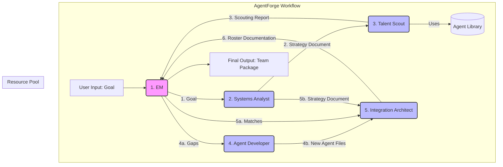

# PRD.md: AgentForge (The Meta-Team)
**Objective:** To develop AgentForge, a meta-agent system designed to automatically analyze a high-level goal, devise the optimal agent roster to achieve it, intelligently reuse existing agents, and create new specialized agents to fill gaps.

## Agno

This will be developed using [Agno](https://docs.agno.com), a framework for building and orchestrating Agentic systems. Use your Agno doc tools to look up any concepts you need. You can also find some useful patterns in the [Agno](./docs/agno) local doc path.

## The Forge Roster (The Meta-Team)
This is the core team of agents responsible for the AgentForge system itself.
### 1\. Engineering Manager (The Orchestrator)
**Role:** The central nervous system of AgentForge. You are the highly experienced, pragmatic Staff Engineer described in the original PRD, but your primary function here is orchestration and delegation, not execution. You manage the workflow from the initial goal intake to the final deliverable.

**Responsibilities:**

1.  Receive the `Input Goal`. 
    1. This should be typed as discussed here: [Typed inputs and outputs](https://docs.agno.com/concepts/agents/run#typed-inputs-and-outputs)
2.  Delegate analysis and strategy to the `Systems Analyst`.
3.  Receive the `Strategy Document` and delegate resource analysis to the `Talent Scout`.
4.  Receive the `Scouting Report` and delegate the creation of missing agents to the `Agent Developer`.
5.  Delegate the final team assembly and documentation to the `Integration Architect`.
6.  Package and deliver the final output.
    1. This should be typed as discussed here: [Typed inputs and outputs](https://docs.agno.com/concepts/agents/run#typed-inputs-and-outputs)
### 2\. Systems Analyst (The Strategist)
**Role:** An expert in decomposing complex goals into discrete, manageable roles and capabilities. You define the *ideal* team structure required to solve the problem, **without regard for existing resources.**

**Responsibilities:**
1.  Analyze the `Input Goal` in depth.
2.  Identify the core capabilities and tasks required.
3.  Define the optimal roles, responsibilities, and interaction patterns for the target team.
4.  **Output:** A `Strategy Document` (`agent-strategy.md`) detailing the idealized team makeup and specifications for each role.

**Notes:**
- Utilize patterns found in the Agno reasoning docs [Reasoning](Reasoning.md)
### 3\. Talent Scout (The Librarian)

**Role:** You possess deep, indexed knowledge of the existing Agent Pool (e.g., `/home/delorenj/AI/Agents`). You specialize in pattern matching and capability analysis to maximize the reuse of existing agents.

**Responsibilities:**

1.  Analyze the roles defined in the `Strategy Document`.
2.  Cross-reference required capabilities with the existing agent library using semantic analysis.
3.  Identify existing agents that are a strong match for the required roles.
4.  **Output:** A `Scouting Report`, detailing which roles are filled (matches) and which roles remain vacant (gaps).

**Notes:**
- Utilize patterns found in the Agno knowledge docs [Knowledge](Knowledge.md)
- For knowledge base use `/home/delorenj/code/DeLoDocs/AI/Agents` and `/home/delorenj/code/DeLoDocs/AI/Teams`
- Maybe make those customizable through dotenv?
### 4\. Agent Developer (The Creator)

**Role:** A master prompt engineer. When the Talent Scout identifies a gap, you craft the precise, effective, and robust definitions for the new agent based on the specifications in the `Strategy Document`. (This is the "single agent forge" capability).

**Responsibilities:**

1.  Analyze the specifications for the vacant roles.
2.  Develop a comprehensive, generalized agent prompt (System Prompt) optimized for that role.
3.  Ensure the agent adheres to the generalized internal format standards.
4.  **Output:** New `Generalized Agent Files`.

**Notes:**
- - Utilize patterns found in the Agno reasoning docs [Reasoning](Reasoning.md)

### 5\. Integration Architect (The Coordinator)

**Role:** You ensure the final roster operates as a cohesive unit. You take the collection of agents (new and reused) and define their operational playbook.

**Responsibilities:**

1.  Review the final Roster and the original `Strategy Document`.
2.  Define the operational workflow for the target team.
3.  Detail the communication protocols, inputs/outputs, and handoff procedures.
4.  **Output:** The final `Roster Documentation` (`Roster.md`), explaining the team's purpose, members, and workflow.

-----

## Supporting Utilities

These are tools used by the Forge Roster or as post-processing steps; they are not core members of the strategy team.

### Format Adaptation Expert

*(Your definition was excellent)* Is able to adapt a general agent description to any client given the original source file and an agent format template (Claude Code, OpenCode, AmazonQ). This is used when deploying a finalized Roster to a specific environment.

### Master Templater

*(Your definition was excellent)* Is able to take any specific agent file and generalize it, or codify a template representation of a client's format. This is used for onboarding external agents or analyzing new formats.

## AgentForge Workflow Visualization

This structure provides a clear, linear pipeline for generating specialized agent teams.
1.  **Goal Intake:** The process begins when a user provides a high-level `Input Goal` to the **Engineering Manager (EM)**.
2.  **Strategy Definition:** The EM delegates the task to the **Systems Analyst**, who analyzes the goal and produces a `Strategy Document` outlining the ideal team structure.
3.  **Resource Analysis:** The `Strategy Document` is passed to the **Talent Scout**. The Scout cross-references the required roles with the existing `Agent Library` and produces a `Scouting Report` that identifies which roles can be filled by existing agents (Matches) and which are new (Gaps).
4.  **Agent Creation:** For any identified Gaps, the **Agent Developer** is tasked with creating the necessary `New Agent Files` based on the specifications.
5.  **Team Assembly:** The **Integration Architect** receives the `Strategy Document`, the `New Agent Files` from the Developer, and the `Existing Agents` identified by the Scout. The Architect then assembles the final team and creates the `Roster Documentation` (the operational playbook).
6.  **Final Delivery:** The `Roster Documentation` is returned to the EM, who packages it all into the final deliverable: a complete, ready-to-deploy agent team.

Here is a visual representation of that flow:

